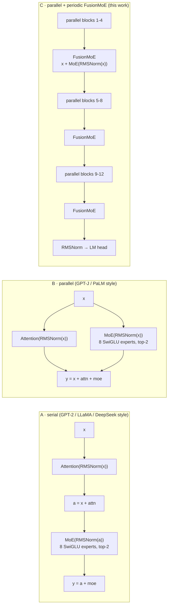
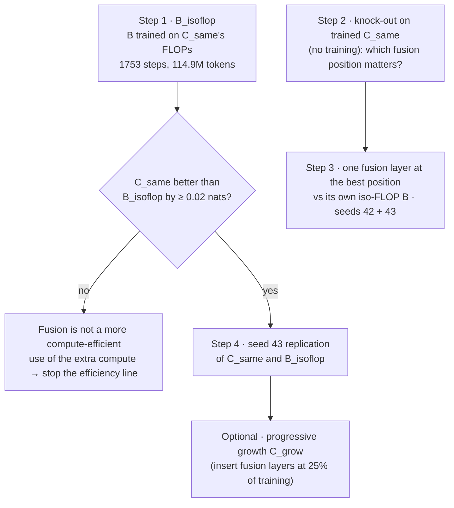

<div align="center">

# Parallel Attention ∥ MoE with Periodic FusionMoE

**A controlled, pre-registered A / B / C architecture experiment on a single A100**

*Can we drop the strict Attention → MoE dependency inside each Transformer block, and win back whatever is lost with a
few periodic "FusionMoE" layers?*


-1baf7a)


[Results](#4-results) · [What we can and cannot claim](#5-interpretation) · [Next steps](#7-next-steps-amendment-5) ·
[Reproduce](#8-reproduce) · [Slides](docs/presentation/slides.pdf) · [Türkçe özet](docs/BULGULAR_TR.md)

</div>

---

## TL;DR

Four ~160M-active-parameter MoE language models (8 experts, top-2) were trained on the **same 100M FineWeb-Edu tokens,
same order, same recipe, same GPU**, and compared on the same 15,088 validation sequences with paired statistics.

| | Finding (seed 42, 100M tokens) | Status |
|---|---|---|
| **Parallel vs serial** | B (parallel) beats A (serial) by **0.089 nats** with *identical* FLOPs and step time. The gap was 0.23 nats at 4M tokens and shrinks steadily: an early-training speed advantage, not a free lunch. It also appears with a dense FFN, so it is not about MoE routing. | robust (2 seeds, 6 conditions) |
| **Fusion, extra compute** | C_same (B + 3 FusionMoE layers, +15% FLOPs) beats B by **0.029 nats**; the gain appears only after ~20M tokens and plateaus after ~65M. | inconclusive (below the 0.053-nat single-seed threshold) |
| **Fusion, same compute** | C_matched (same parameters and FLOPs as B) **ties B** (−0.002). Narrowing the experts costs a constant +0.027; the fusion gain cancels it. | approximately equal |
| **Efficiency** | Per wall-clock, **B is best**. C_matched is 9% slower for the same quality; C_same needs ~3% more FLOPs (~5% more time) to reach B's final loss. | no evidence fusion is more efficient |

> **Bottom line so far:** in this regime the parallel block is the better default, and periodic fusion adds a small
> amount of quality only when it is paid for with extra compute. Whether that extra compute would be better spent on
> more training tokens is the open question; [Amendment 5](#7-next-steps-amendment-5) tests it next.

---

## Contents

1. [Question](#1-question)
2. [Architectures](#2-architectures)
3. [Experimental design](#3-experimental-design)
4. [Results](#4-results) — [pilot](#41-pilot-25m-tokens) · [diagnostics](#42-diagnostics-why-does-parallel-beat-serial) · [MAIN](#43-main-100m-tokens)
5. [Interpretation](#5-interpretation)
6. [Limitations](#6-limitations)
7. [Next steps (Amendment 5)](#7-next-steps-amendment-5)
8. [Reproduce](#8-reproduce)
9. [Repository layout](#9-repository-layout)
10. [References](#10-references)

---

## 1. Question

Most modern MoE LLMs (DeepSeek-V3, Kimi K2, GLM-4.5) keep the serial block: the MoE feed-forward reads the output of
the attention in the same layer. GPT-J and PaLM showed the two sublayers can instead run **in parallel** from the same
input (PaLM: ~15% faster at scale through fused input projections; small quality loss at 8B, none at 62B).

This project asks whether a **parallel MoE block** loses something, and whether a few **FusionMoE** layers — a
token-wise MoE applied to the residual stream after every 4 parallel blocks — can recover it.
The original idea and discussion (in Turkish) are kept in [`docs/concept/`](docs/concept/ORIGINAL_CONCEPT_TR.md); the
full engineering brief is [`docs/concept/EXPERIMENT_PROMPT.md`](docs/concept/EXPERIMENT_PROMPT.md).

## 2. Architectures



Shared by all models: 12 layers, d_model 768, 12 × 64 heads, RoPE, RMSNorm, 8 SwiGLU experts with top-2 routing and no
token dropping, tied embeddings, 32k BPE vocabulary, context 1024. A and B have **bit-identical initial weights**.

| model | MoE layers | expert hidden | total params | active params / token | train FLOPs / token |
|---|---|---|---|---|---|
| **A** serial | 12 | 1920 | 477.65M | 159.15M | 1.068 G |
| **B** parallel | 12 | 1920 | 477.65M | 159.15M | 1.068 G |
| **C_same** parallel + fusion | 12 + 3 | 1920 | 583.84M | 185.71M | 1.227 G (+15%) |
| **C_matched** parallel + fusion | 12 + 3 | 1536 | 477.67M | 159.17M | 1.068 G |

`C_same` asks *does adding fusion help?* (extra compute). `C_matched` asks *is fusion a better use of the same budget?*:
its experts are narrowed so that 15 × 1536 = 12 × 1920 (expert parameters and active FLOPs match B to 0.000%).

## 3. Experimental design

Everything that is not the architecture is held fixed and **audited automatically** after every run (17 checks: train
config, steps, tokens, micro-batch, evaluation steps, validation set, GPU model, attention/MoE/parallel backends, code
fingerprint, dataset hashes). Details: [`METHODOLOGY.md`](moe_fusion_experiment/METHODOLOGY.md).

| | |
|---|---|
| Data | FineWeb-Edu `sample-10BT`, pinned revision, first 300k documents, document-level train/validation split; rebuilt byte-identically after a runtime reset |
| Recipe | AdamW (0.9, 0.95, wd 0.1), peak LR 3e-4, 2% warm-up, cosine to 10%, clip 1.0, global batch 64 × 1024 tokens, BF16 autocast with FP32 master weights / router / loss |
| MoE | Switch load-balancing loss 0.01 per router (summed), z-loss logged only, no capacity limit |
| Evaluation | paired per-sequence differences on the full validation set (15.45M tokens), normal and bootstrap 95% CIs, fraction of sequences that improve |
| Pre-registration | hypotheses and decision rules written **before** each phase; every change is a dated amendment in [`EXPERIMENT_SPEC.md`](moe_fusion_experiment/EXPERIMENT_SPEC.md) |

| phase | tokens / model | runs | question | amendment |
|---|---|---|---|---|
| Pilot | 25.2M | A, B, C_same, C_matched | catch bugs, first comparison | 1 (balance loss summed per router, as in Switch) |
| Diagnostics | 25.2M | A vs B × 4 conditions | is the surprising B > A gap real, and why? | 3 (rules R1-R4) |
| MAIN | 100.0M | A, B, C_same, C_matched | the fusion verdict | 2 (protocol), 4 (single-seed threshold) |
| Follow-ups | — | planned | is fusion a better use of compute than more tokens? | 5 (plan) |

## 4. Results

All numbers below are read from the logs in [`results/`](results/); every report there is machine-generated.

### 4.1 Pilot (25M tokens)

| | A | B | C_same | C_matched |
|---|---|---|---|---|
| final validation loss | 5.4918 | **5.3129** | 5.3175 | 5.3715 |
| training minutes | 8.2 | 8.1 | 9.5 | 8.9 |

B beat A by 0.179 nats, which contradicts the expectation that the serial block is at least as good. C_same tied B
(+0.005) and C_matched was worse (+0.059). Before spending 100M tokens, the B > A gap was put under test.
Report: [`results/pilot/FINAL_REPORT.md`](results/pilot/FINAL_REPORT.md).

### 4.2 Diagnostics: why does parallel beat serial?

<picture>
  <source media="(prefers-color-scheme: dark)" srcset="docs/figures/b_minus_a_summary_dark.png">
  
</picture>

| rule (pre-registered) | measurement | verdict |
|---|---|---|
| **R1** real or seed noise? | seed 42: −0.172, seed 43: −0.119 | **robust** |
| **R2** MoE-specific? | dense FFN control: −0.136 | **not MoE-specific** |
| **R3** short warm-up artefact? | 10% warm-up: −0.197 (both models improve, gap widens) | **not a warm-up artefact** |
| **R4** routing instability? | serial routing churn 1.24× / 1.19× parallel in the first quarter | weak (below 1.5×) |

**Conclusion:** the advantage is a property of this training regime (small, heavily under-trained model, one shared
recipe), not of MoE routing. The diagnostics also measured the seed-to-seed variation of an architecture difference,
**0.053 nats**, which became the single-seed decision threshold for MAIN (Amendment 4).
In the dense control the MoE did not yet beat a dense FFN of equal active compute at 25M tokens (B: 5.3298 MoE vs
5.3305 dense), as expected this early in training. Report: [`results/diagnostics/DIAG_REPORT.md`](results/diagnostics/DIAG_REPORT.md).

### 4.3 MAIN (100M tokens)

<picture>
  <source media="(prefers-color-scheme: dark)" srcset="docs/figures/main_loss_vs_tokens_dark.png">
  
</picture>

| model | final validation loss | perplexity | training wall-clock | tokens / s | peak memory |
|---|---|---|---|---|---|
| A serial | 4.1564 | 63.84 | 32.3 min | 51,562 | 29.9 GB |
| B parallel | 4.0672 | 58.40 | 32.3 min | 51,570 | 29.3 GB |
| C_same | **4.0379** | **56.71** | 37.7 min | 44,228 | 33.8 GB |
| C_matched | 4.0651 | 58.27 | 35.2 min | 47,326 | 30.4 GB |

Paired differences (same 15,088 validation sequences; negative = first model better):

| comparison | ΔL [95% CI] | sequences improved | pre-registered verdict |
|---|---|---|---|
| B − A | −0.0891 [−0.0899, −0.0883] | 99.6% | **better** |
| C_same − B | −0.0293 [−0.0297, −0.0290] | 92.2% | **inconclusive** (0.02 ≤ abs ΔL < 0.053) |
| C_matched − B | −0.0021 [−0.0025, −0.0018] | 54.3% | **approximately equal** |
| C_matched − C_same | +0.0272 [+0.0268, +0.0276] | 10.6% | inconclusive |

**The gaps over training** — the most informative view, because it shows *when* each effect appears:

<picture>
  <source media="(prefers-color-scheme: dark)" srcset="docs/figures/main_gaps_dark.png">
  
</picture>

* **B − A** shrinks from −0.23 (4M tokens) to −0.089; B reaches A's final loss after 77% of the tokens.
* **C_same − B** is zero for the first ~20M tokens, then opens and settles near −0.028 after ~65M. The 25M-token pilot
  stopped just before this happened.
* **C_matched − C_same** is flat at ≈ +0.027 from the start: the price of narrowing all 12 main MoE layers by 20%.
* **C_matched − B** is the sum of the two, and crosses zero at ~67M tokens: the fusion gain exactly pays for the
  narrowing.

**Wall-clock efficiency:**

<picture>
  <source media="(prefers-color-scheme: dark)" srcset="docs/figures/main_loss_vs_wallclock_dark.png">
  
</picture>

| at B's finishing time (32.3 min) | A 4.1541 | **B 4.0656** | C_same 4.0821 | C_matched 4.0857 |
|---|---|---|---|---|

| to reach B's final loss | tokens | training time | FLOPs vs B |
|---|---|---|---|
| B | 100.0M | 32.3 min | 1.00× |
| C_same | 90.0M | 33.9 min | ≈ 1.03× |
| C_matched | 99.0M | 34.9 min | ≈ 0.99× (but 8% slower per FLOP) |

**Pre-registered fusion verdict: INCONCLUSIVE.** Replicate B and the C variants before concluding.
Full report: [`results/main/FINAL_REPORT.md`](results/main/FINAL_REPORT.md).

## 5. Interpretation

**Why do A and B take the same time, if B is "parallel"?**
They do exactly the same work: identical parameters, FLOPs and median step time (1269.3 ms). The parallel block only
changes *what the MoE reads* (x instead of x + attention). Speed-ups from a parallel block come from fusing the
attention and MLP input matrix multiplications (PaLM) or from executing the two branches concurrently. Concurrent CUDA
streams were measured in the pilot and gave ≤ 1%: at this size each kernel already fills the A100. With MoE the FFN
input goes through a router and per-expert weights, so the PaLM-style fused projection does not carry over directly.

**Why is the serial model worse?** Not because it computes less. The parallel model learns faster early (shorter
effective depth of the residual path is one plausible reason; routing instability is not the main one, since the dense
control shows the same gap). The serial model is catching up (−0.23 → −0.089). This agrees with GPT-J/NeoX and PaLM,
where the difference vanishes at scale; we cannot say from these runs when it would close.

**Is fusion useful?**
* *Quality:* there is a consistent but small and unreplicated signal: +15% compute buys 0.029 nats, improving 92% of
  sequences, appearing only after ~20M tokens.
* *At equal compute:* no. Spending the budget on 3 fusion layers instead of wider experts gives the same loss (−0.002)
  and is 9% slower in this implementation (15 instead of 12 MoE dispatches).
* *Efficiency:* no evidence in favour. A rough two-point power-law fit of B's own pilot and MAIN losses suggests that
  15% more training tokens would improve B by ~0.09 nats, about three times the fusion gain. This is an extrapolation,
  which is exactly why Amendment 5 tests it directly with an iso-FLOP baseline.
* *Mechanism:* the premise "B loses interaction, C recovers it" does not hold here, since B loses nothing to A. The
  simplest explanation of C_same's gain is added depth and capacity, which C_matched supports.

## 6. Limitations

* **Scale.** ~160M active parameters and 100M tokens (~0.6 tokens per active parameter, far below compute-optimal):
  small-scale architectural evidence, not a claim about billion-parameter LLMs.
* **Seeds.** MAIN is a single seed; paired CIs only cover validation noise. The 0.053-nat threshold comes from one
  measured seed pair.
* **Recipe.** One shared learning rate for all architectures (by design, untuned); the parallel advantage may be
  partly recipe-dependent.
* **Schedule.** Time-to-target and loss-at-common-time read intermediate points of a cosine schedule, which are
  pessimistic for the slower model (Hoffmann et al., 2022).
* **Implementation.** Reference (sequential-dispatch) MoE; wall-clock numbers are specific to it.

## 7. Next steps (Amendment 5)

Written **before** any follow-up run ([spec §6e](moe_fusion_experiment/EXPERIMENT_SPEC.md)); each step runs only if
the previous one leaves the question open.



| step | what | cost (A100) |
|---|---|---|
| 1 | **B_isoflop**: is fusion better than simply training B longer on the same compute? | ~1 h |
| 2 | **Knock-out** of each fusion layer in the trained C_same (no training) | ~15 min |
| 3 | **One fusion layer** (`fusion_interval: 8` or `final_only`, ~+5% FLOPs) vs its iso-FLOP B, 2 seeds | ~2.5 h |
| 4 | **Seed 43** for anything still undecided | ~1.5 h |

Not planned: a 400M-token MAIN (C_same − B is flat after ~65M tokens, so the expected information per GPU-hour is low).

## 8. Reproduce

Everything runs from **one Colab cell** on an A100; the cell asks for the code zip
([`dist/moe_fusion_experiment.zip`](dist/moe_fusion_experiment.zip), v1.4.2), restores or rebuilds the dataset
byte-identically, runs environment checks, the test suite, the memory probe and a smoke test, then trains and writes the
report, plots and a results zip (mirrored to Google Drive; interrupted runs resume from checkpoints).

| phase | cell | time |
|---|---|---|
| Pilot | [`colab/PILOT_SINGLE_CELL.py`](moe_fusion_experiment/colab/PILOT_SINGLE_CELL.py) | ~1 h (incl. systems benchmark + profiling) |
| Diagnostics | [`colab/DIAG_SINGLE_CELL.py`](moe_fusion_experiment/colab/DIAG_SINGLE_CELL.py) | ~1.6 h |
| MAIN | [`colab/MAIN_SINGLE_CELL.py`](moe_fusion_experiment/colab/MAIN_SINGLE_CELL.py) | ~2.9 h |

Locally:

```bash
cd moe_fusion_experiment
pip install -r requirements.txt
python -m pytest -q tests                                   # 58 CPU tests (+7 CUDA tests on a GPU)
python scripts/run_pipeline.py --mode main --data-dir /path/to/moe_data --out runs
python scripts/aggregate_results.py --root runs/main --mode main
python ../docs/figures/make_figures.py                      # README figures from ../results
```

## 9. Repository layout

```
README.md                    this page
docs/
  figures/                   README figures (light + dark) and the script that builds them from results/
  presentation/              slide deck (Marp source + PDF)
  BULGULAR_TR.md             full analysis in Turkish
  concept/                   the original idea (Turkish), the engineering brief, the original data manifests
results/
  pilot/  diagnostics/  main/   machine-generated reports, results.json, per-run metrics, plots
moe_fusion_experiment/       the code: src/moefusion (models, MoE, trainer, analysis), scripts, configs, tests, colab
dist/moe_fusion_experiment.zip   the package uploaded by the Colab cells
```

Profiler traces from the pilot (~170 MB) are not committed.

## 10. References

Full list with the specific claims used: [`REFERENCES.md`](moe_fusion_experiment/REFERENCES.md). Key ones:
Chowdhery et al. 2022 (PaLM, parallel layers) · Wang & Komatsuzaki 2021 (GPT-J) · Black et al. 2022 (GPT-NeoX-20B) ·
Fedus et al. 2022 (Switch Transformers) · Jiang et al. 2024 (Mixtral) · Dai et al. 2022 (StableMoE) ·
Hoffmann et al. 2022 (Chinchilla) · Penedo et al. 2024 (FineWeb) · Press et al. 2020 (Sandwich Transformer).

---

<sub>Licensed under MIT (see [LICENSE](LICENSE)). Experiment design, code and analysis were developed with
Claude Code.</sub>
