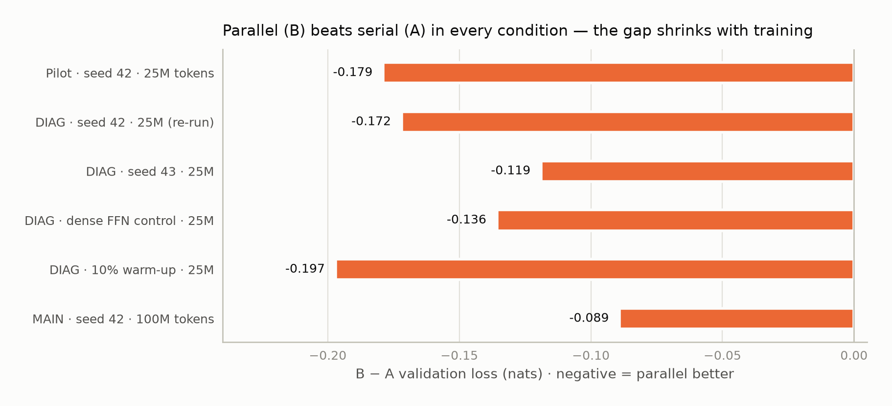
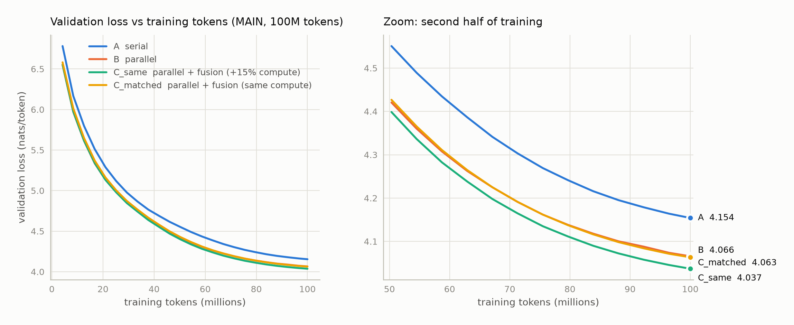
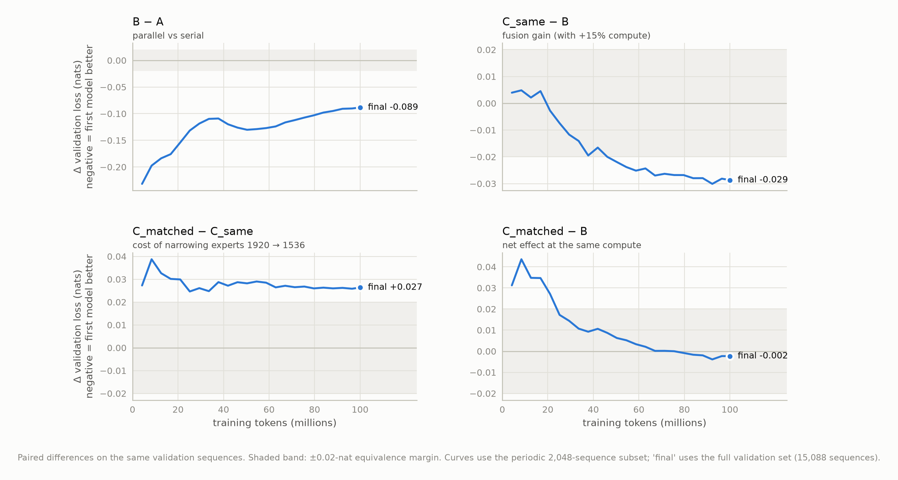
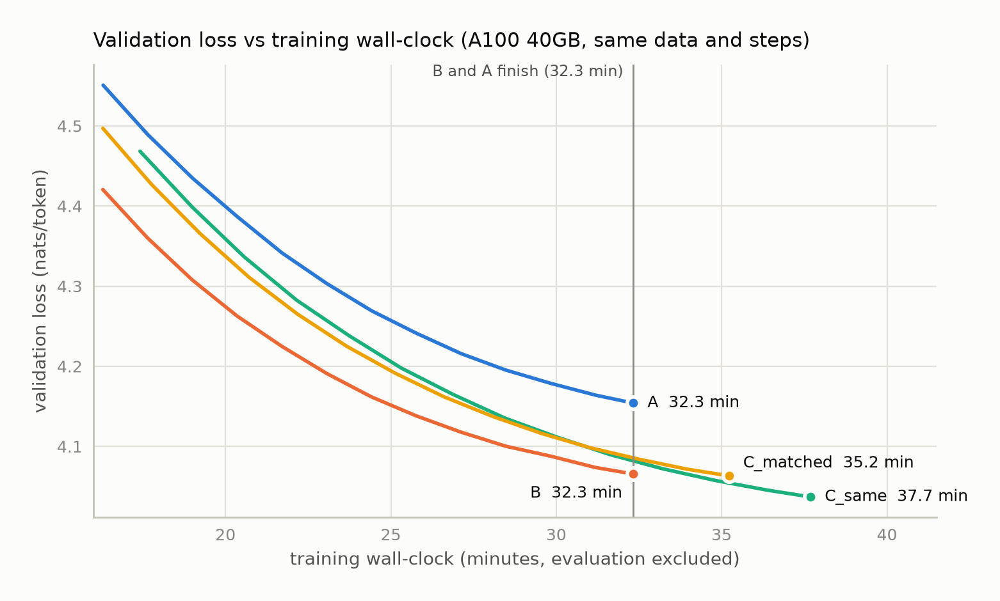

<!-- _class: lead -->
<!-- _paginate: false -->

# Parallel Attention ∥ MoE with Periodic FusionMoE

A controlled, pre-registered A / B / C experiment

~160M-active-parameter MoE language models · FineWeb-Edu · single A100 40GB

---

## The question

Modern MoE LLMs (DeepSeek-V3, Kimi K2, GLM-4.5) are **serial**: the MoE reads the attention output of the same layer.
GPT-J and PaLM run the two sublayers **in parallel** from the same input.

1. Does a **parallel MoE block** lose quality?
2. Can a few **FusionMoE** layers (a token-wise MoE after every 4 parallel blocks) win it back?
3. Is the result a better **quality-per-compute** trade-off?

---

## Three architectures, everything else identical

| | block | MoE layers | expert width | FLOPs / token |
|---|---|---|---|---|
| **A** | `a = x + Attn(x)` → `y = a + MoE(a)` | 12 | 1920 | 1.068 G |
| **B** | `y = x + Attn(x) + MoE(x)` | 12 | 1920 | 1.068 G |
| **C_same** | B + FusionMoE after blocks 4, 8, 12 | 15 | 1920 | 1.227 G (+15%) |
| **C_matched** | same, experts narrowed so 15 × 1536 = 12 × 1920 | 15 | 1536 | 1.068 G |

12 layers · d 768 · 8 SwiGLU experts, top-2 · same data, order, recipe, GPU · A and B start from **identical weights**
17 automated fairness checks after every run · decision rules written before each phase

---

## Three phases

| phase | tokens / model | what | outcome |
|---|---|---|---|
| **Pilot** | 25M | A, B, C_same, C_matched | B beats A by 0.179 (unexpected) |
| **Diagnostics** | 25M | A vs B × 4 conditions | the gap is real, not MoE-specific |
| **MAIN** | 100M | all four | fusion verdict: inconclusive |

Each phase's rules are a dated amendment in EXPERIMENT_SPEC.md (Amendments 1–5).

---

## Diagnostics: is "parallel beats serial" real?

Robust across seeds · also with a **dense FFN** · not a warm-up artefact → a property of this **regime**, not of MoE routing.
Seed-to-seed spread 0.053 nats → the single-seed decision threshold for MAIN.

---

## MAIN: 100M tokens

---

## MAIN: final numbers (15,088 validation sequences)

| model | val loss | ppl | time | tokens/s |
|---|---|---|---|---|
| A serial | 4.1564 | 63.8 | 32.3 min | 51.6k |
| B parallel | 4.0672 | 58.4 | 32.3 min | 51.6k |
| C_same | **4.0379** | **56.7** | 37.7 min | 44.2k |
| C_matched | 4.0651 | 58.3 | 35.2 min | 47.3k |

| paired ΔL | value [95% CI] | verdict |
|---|---|---|
| B − A | −0.089 [−0.090, −0.088] | **better** |
| C_same − B | −0.029 [−0.030, −0.029] | **inconclusive** (< 0.053) |
| C_matched − B | −0.002 [−0.003, −0.002] | **equal** |

---

## When does each effect appear?

---

## Reading the gaps

- **B − A** shrinks 0.23 → 0.089: parallel learns faster early; serial is catching up.
- **C_same − B** is zero until ~20M tokens, then settles near −0.028. The 25M pilot stopped just before it appeared.
- **C_matched − C_same** ≈ +0.027 throughout: the cost of narrowing every main expert by 20%.
- **C_matched − B** = cost + gain → crosses zero at ~67M tokens.

At equal compute, fusion only trades expert width for extra MoE layers: **no net gain** at 100M tokens.

---

## Efficiency: B wins per wall-clock

C_matched: same FLOPs, 9% slower, same loss · C_same reaches B's final loss with ~3% more FLOPs (~5% more time)

---

## Why A and B take the same time

- Same parameters, same FLOPs, same step time (1269.3 ms): **nothing is computed less**.
- PaLM's ~15% speed-up comes from **fusing** attention and MLP input projections, not from overlap.
- Concurrent CUDA streams measured: **≤ 1%** — each kernel already fills the A100.
- MoE inputs go through a router and per-expert weights → the PaLM fusion does not carry over directly.

---

## What we can claim

| claim | evidence |
|---|---|
| Parallel ≥ serial **in this regime** | 6 conditions, 2 seeds, dense control |
| Fusion adds ~0.03 nats **with +15% compute** | 1 seed, 92% of sequences, below threshold |
| Fusion gives **nothing at equal compute** | C_matched = B, 9% slower |
| Fusion is **not shown to be efficient** | B best per wall-clock; more tokens likely worth more (~0.09, rough fit) |

Limits: 160M active params, 100M tokens (~0.6 tokens/param), one shared untuned LR, single-seed MAIN.

---

## Next: Amendment 5 (pre-registered, not yet run)

| step | test | cost |
|---|---|---|
| 1 | **B_isoflop** — B trained on C_same's FLOPs (114.9M tokens). C_same must win by ≥ 0.02, else stop | ~1 h |
| 2 | **Knock-out** of each fusion layer in the trained C_same (no training) | ~15 min |
| 3 | **One fusion layer** at the best position vs its iso-FLOP B, 2 seeds | ~2.5 h |
| 4 | **Seed 43** for anything undecided | ~1.5 h |

Optional: progressive growth (insert fusion layers at 25% of training) if step 1 favours C_same.

---

<!-- _class: lead -->

# Thank you

Code, logs, reports and this deck:
**github.com/emirkocSU/Transformer-Parallel-Fusion-MoE**

Every number in this deck is read from machine-generated reports in `results/`.
