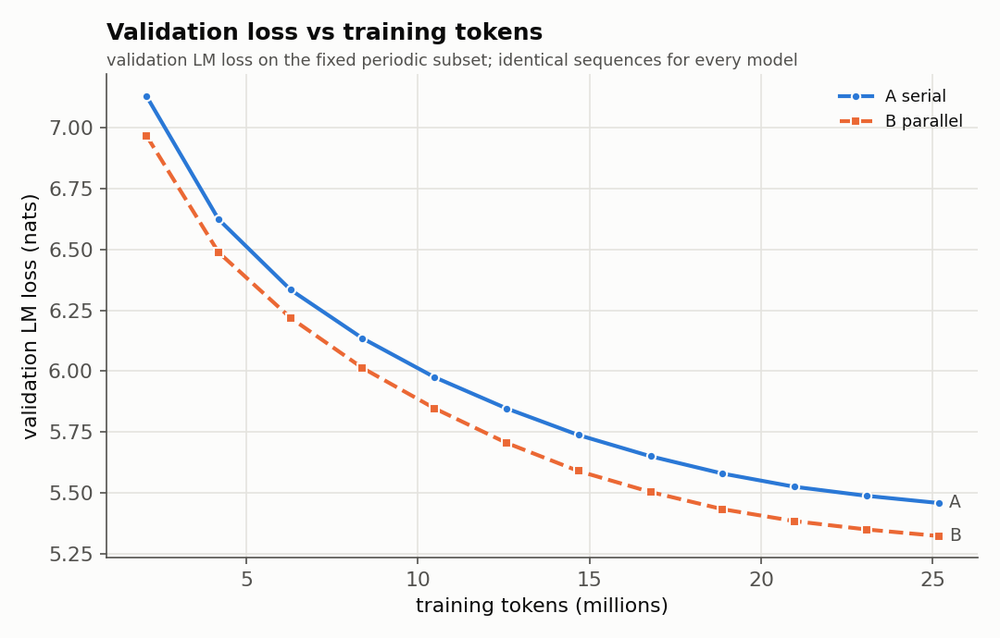
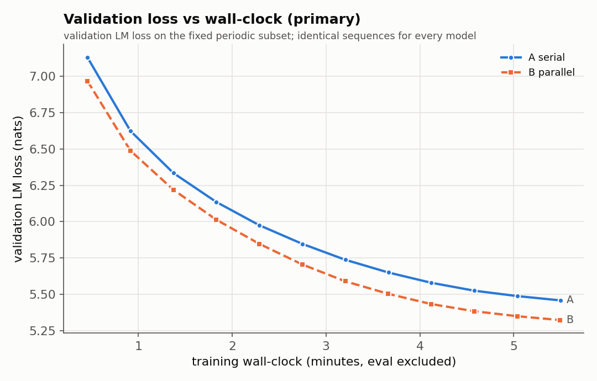
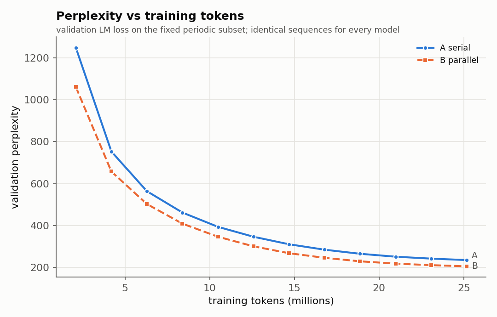
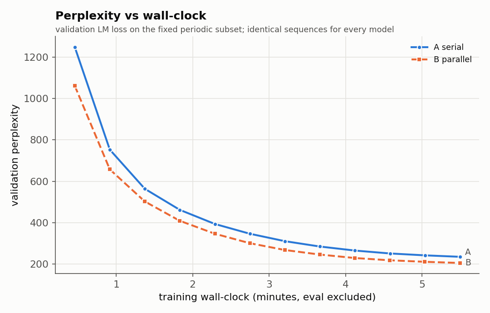
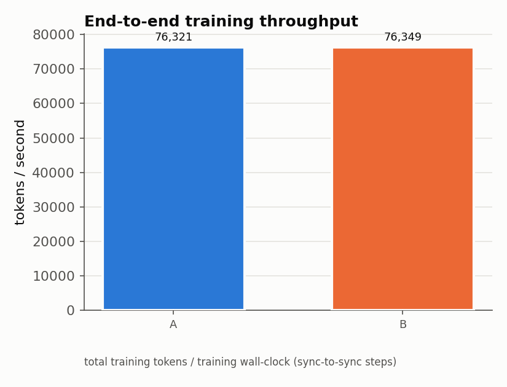
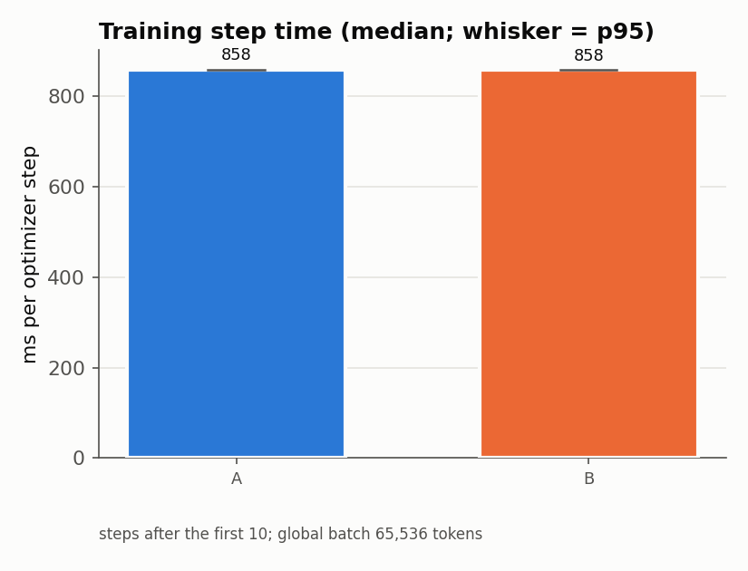
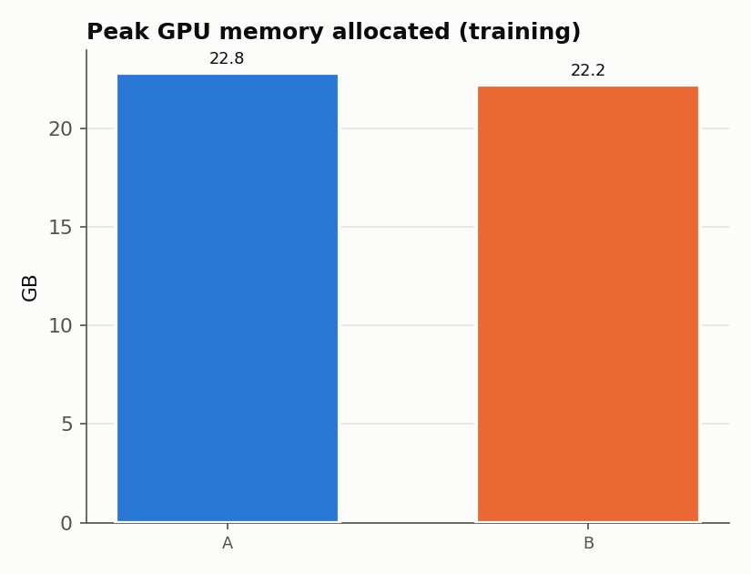
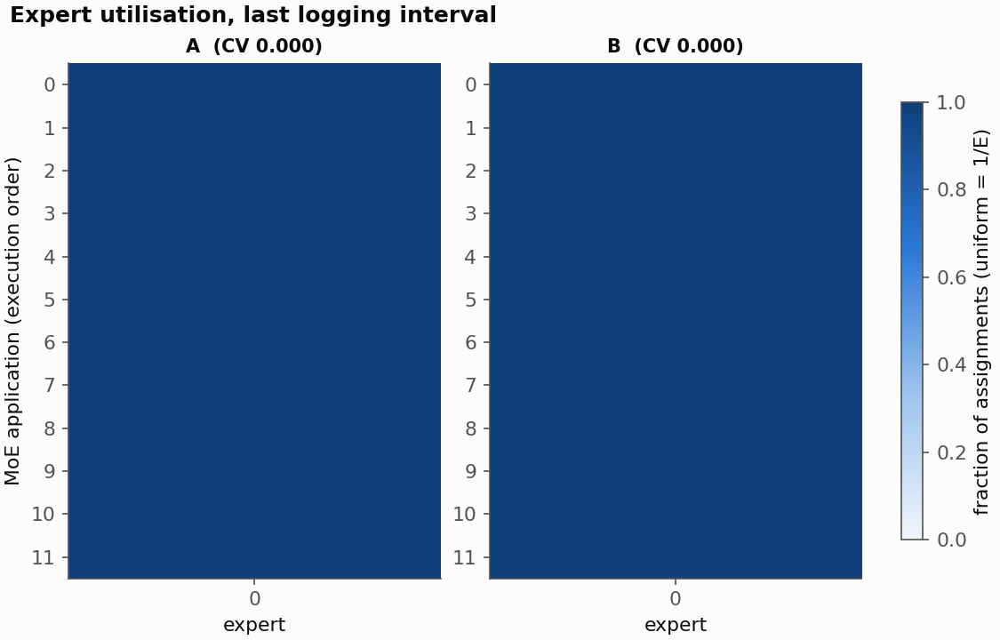
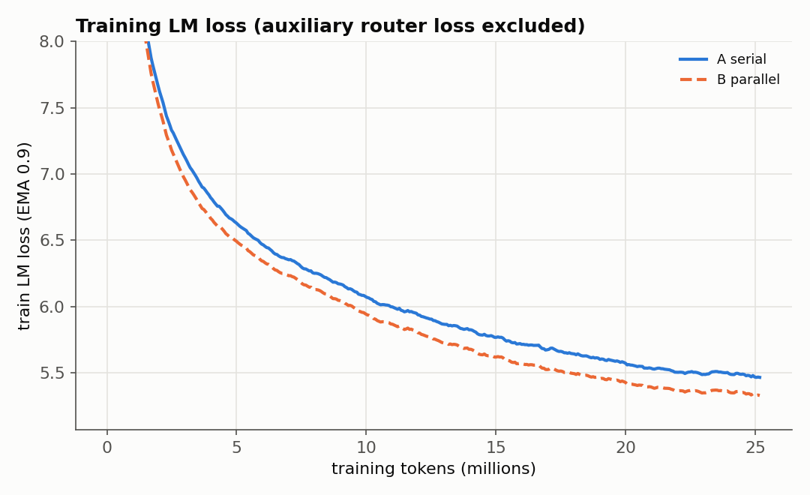

# FINAL REPORT - Serial vs Parallel vs Parallel+Fusion MoE (PILOT)

_Generated automatically 2026-10-04T20:17:46+0000 from experiment logs in `/content/moe_fusion_runs/diag_dense`. No number in this file is hand-written._

> **STATUS: PILOT.** One paired seed, ~25M tokens per model. The pre-registered purpose of the pilot is to detect catastrophic bugs and obtain a first, NON-CONFIRMATORY comparison. Confidence intervals below capture validation-data noise only, not seed-to-seed training variance. No claim in this report is confirmatory.

## VERDICT (pre-registered rule, EXPERIMENT_SPEC Amendment 2)

**Fusion (your parallel + periodic FusionMoE method): None**

Rule: d_s = paired dL per seed; better/worse require the same sign with a CI excluding 0 in EVERY seed AND |mean d| >= max(0.02 nats, observed seed spread); equal requires |d| < 0.02 nats in every seed.

| comparison | dL per seed (nats) | mean dL | threshold | verdict |
|---|---|---|---|---|
| B - A (parallel vs serial) | -0.1357 | -0.1357 | 0.020 | better (CI excludes 0 and abs(dL) >= 0.020 nats) |

| model | final val loss per seed | mean | train minutes (mean) |
|---|---|---|---|
| A | 5.4662 | 5.4662 | 5.5 |
| B | 5.3305 | 5.3305 | 5.5 |

## A. Experiment question

Can the strict Attention -> MoE dependency be removed from most Transformer layers (Attention and MoE as parallel branches) and the lost interaction recovered by periodic Fusion MoE layers, giving a better quality-versus-wall-clock trade-off?

## B. Architecture definitions

* **A (serial):** `a = x + Attn(RMSNorm(x)); y = a + MoE(RMSNorm(a))`
* **B (parallel):** `y = x + Attn(RMSNorm_a(x)) + MoE(RMSNorm_m(x))` - identical parameter set to A (bit-identical init).
* **C (parallel + fusion):** B blocks, plus `x = x + FusionMoE(RMSNorm_f(x))` after blocks 4, 8 and 12 (12 attention + 15 MoE applications). `C_same`: expert hidden 1920 (extra compute, mechanism test). `C_matched`: expert hidden 1536 so that 15 x 1536 = 12 x 1920 (compute/parameter matched).
* Shared: 12 layers, d_model 768, 12 heads x 64, RoPE, RMSNorm, 8 SwiGLU experts top-2 (no token dropping), tied embeddings, vocab 32,000, context 1024, BF16 autocast.

## C. Dataset

* Source: FineWeb-Edu sample-10BT (pinned revision, first 300k documents, document-level split).
* train.npy [287264, 1025] / validation.npy [15088, 1025] (seq_len+1 (input=row[:-1], target=row[1:])).
* Leakage check: {'train_docs': 285000, 'val_docs': 15000, 'source_ids_available': True, 'source_id_overlap': 0, 'exact_text_overlap_docs': 13, 'exact_text_overlap_fraction_of_val': 0.0008666666666666666, 'duplicate_texts_within_val': 0, 'passed': True}
* Re-tokenisation provenance check: validation: VERIFIED (append), train: VERIFIED (append)

* Data was rebuilt from the pinned source by `prepare_fineweb.py`: byte-identical to the original preparation = **True**; inferred conventions {'validation_rule': 'doc_index % 20 == 0', 'eot_per_doc': 1, 'eot_placement': 'append', 'dtype': 'uint16', 'row_len': 1025, 'jsonl_format': 'id_text_utf8'}.

* Dataset warnings: 13 validation documents have an exact-text duplicate in train under different source ids (web near-duplicates; reported, not removed)

## D. Tokenizer

One ByteLevel-BPE artifact for every model: vocab 32000, special tokens {'<|unk|>': 0, '<|endoftext|>': 1}, sha256 `2a6d7dcaa8f5cfec135c835ff0cf5ffb14c1f9508c0cfb8113bfebc3883c2187`.

## E. Training setup (identical for every architecture)

* Steps 384, tokens 25,165,824, global batch 64 x 1024 tokens, micro-batch 16 x grad-accum 4 (common to all, from the memory probe), AdamW(0.9, 0.95, wd 0.1), peak LR 0.0003, 2% linear warm-up, cosine to 0.1 x peak, clip 1.0, balance-loss coefficient 0.01 per router (sum over MoE applications), z-loss coefficient 0.0 (always logged), BF16 autocast with FP32 master weights / router / norms / loss.
* Same data order (BatchSchedule seeded by the paired seed), same evaluation points, same validation rows; evaluation and checkpoint time excluded from the wall-clock axis.

* **Automated fairness audit: PASSED**

| check | result | detail |
|---|---|---|
| train config identical (B_dense vs A_dense) | PASS |  |
| model config differs only in architecture fields (B_dense) | PASS |  |
| identical optimizer steps | PASS | {'A_dense': 384, 'B_dense': 384} |
| identical training tokens | PASS |  |
| identical micro-batch / grad-accum | PASS |  |
| identical evaluation steps | PASS |  |
| identical final validation set | PASS |  |
| all runs (incl. resumed segments) on the same GPU model | PASS | {'NVIDIA A100-SXM4-40GB'} |
| identical attention_backend | PASS |  |
| identical moe_backend | PASS |  |
| identical parallel_backend | PASS |  |
| identical code fingerprint | PASS | {'69b579d404fc19b5618e9569f274178f5fab5a41ef7df02233bc93271a00b3d6'} |
| identical dataset hashes | PASS |  |

## F. Hardware / software environment

GPU NVIDIA A100-SXM4-40GB (42.41 GB, cc 8.0), driver/nvidia-smi `580.82.07, NVIDIA A100-SXM4-40GB, 40960 MiB, 1410 MHz`, PyTorch 2.11.0+cu130, CUDA 13.0, Python 3.13.15. Attention backend: **sdpa_flash** (fallback used: False). MoE backend: reference. Primary comparison parallel execution: reference (sequential dispatch) for every architecture.

## G/H. Parameter and FLOP budget

| model | MoE apps | expert hidden | total params | expert params | active params/token | train FLOPs/token |
|---|---|---|---|---|---|---|
| A_dense | 12 | 3840 | 159.084M | 106.168M | 159.084M | 1.068B |
| B_dense | 12 | 3840 | 159.084M | 106.168M | 159.084M | 1.068B |

## I. Validation results (MEASURED)

| model | final val LM loss (full val set) | perplexity | val tokens |
|---|---|---|---|
| A | 5.4662 | 236.55 | 15,450,112 |
| B | 5.3305 | 206.53 | 15,450,112 |

Paired differences (row model minus column model, same validation sequences; 95% CI):

| comparison | dL (nats) [95% CI] | bootstrap CI | seqs where first is better | classification |
|---|---|---|---|---|
| Q1: B vs A (cost of removing same-layer Attention->MoE dependency) | -0.1357 [-0.1363, -0.1351] | [-0.1363, -0.1351] | 100.0% | better (CI excludes 0) |

## J/K. Throughput and wall-clock (MEASURED)

| model | training wall-clock (min) | tokens/s | median step (ms) | p95 step (ms) | median data wait (ms) |
|---|---|---|---|---|---|
| A | 5.50 | 76,321 | 858.5 | 859.2 | 1.32 |
| B | 5.49 | 76,349 | 858.1 | 858.8 | 1.35 |

**Time-to-target** (targets = worst final periodic-subset loss (5.4582) + [0.0, 0.05, 0.1, 0.25]; periodic-subset curve, linear interpolation):

| target loss | A (min / M tokens) | B (min / M tokens) |
|---|---|---|
| 5.4582 | 5.50 / 25.2 | 3.96 / 18.1 |
| 5.5082 | 4.78 / 21.9 | 3.64 / 16.7 |
| 5.5582 | 4.30 / 19.7 | 3.37 / 15.4 |
| 5.7082 | 3.36 / 15.4 | 2.74 / 12.5 |

**Loss at common wall-clock** T* = 5.49 min (validation loss (periodic subset) linearly interpolated at the training wall-clock at which the FASTEST model finished its token budget): A 5.4584, B 5.3227

## L. VRAM (MEASURED)

A: 22.8 GB allocated / 23.1 GB reserved, B: 22.2 GB allocated / 22.5 GB reserved

## M. Router / expert behaviour (MEASURED)

| model | utilisation CV (mean over layers) | worst max/min ratio | min expert fraction | router entropy (max ln8=2.079) | alerts |
|---|---|---|---|---|---|
| A | 0.000 | 1.00 | 1.0000 | 0.000 | none |
| B | 0.000 | 1.00 | 1.0000 | 0.000 | none |

## N. CUDA concurrency / profiling evidence (MEASURED)

Traces: `profiles/*.json` (open in https://ui.perfetto.dev). Method and caveats: `src/moefusion/trace_analysis.py`.

## O. Failures or anomalies

* 13 validation documents have an exact-text duplicate in train under different source ids (web near-duplicates; reported, not removed)

## P. Statistical uncertainty

Single paired seed. Paired CIs over validation sequences quantify evaluation noise only. Seed-to-seed variance of small LMs is typically of the same order as the effects of interest, so differences below the pre-registered margin (0.02 nats) - and any difference before the 3-seed replication - must be treated as provisional.

## Q. Answers to the pre-registered questions

_MEASURED values are followed by the INTERPRETATION that the pre-registered rules allow._

**Q1 - quality lost from A to B:** MEASURED dL(B-A) = -0.1357 [-0.1363, -0.1351] nats. INTERPRETATION: better (CI excludes 0).

**Q2 - recovered by C:** n/a

**Q3 - does C help when compute is matched:** n/a

**Q4 - A100 wall-clock speed-up of the parallel structure:** MEASURED training step time B vs A: -0.04% (both use the same sequential dispatch). Benchmark concurrency ratio: not available. INTERPRETATION: differences below 2% are treated as no speed difference. A mathematically parallel block yields hardware speed-up only through kernel concurrency or fused projections (see Q5/Q6); with sequential dispatch it performs the same work as A.

**Q5/Q6:** benchmark not available.

**Q7 - time-to-target:** see the table in section J/K.

**Q8 - best validation loss per token (equal tokens for all):** MEASURED lowest final loss: **B** (5.3305). Whether it is distinguishable from the others: see the paired table.

**Q9 - best validation loss per wall-clock second:** MEASURED lowest loss at common wall-clock T*: **B** (5.3227). Note that C_same also spends more compute per token.

## R. Limitations

* Small scale (12 layers, d 768, ~160M active / ~480-590M total params, 25M-100M tokens): evidence is small-scale architectural evidence, not a claim about billion/trillion-parameter LLMs.
* One seed in the pilot; CI excludes training-seed variance.
* Hyperparameters were NOT tuned per architecture (by design); a recipe tuned for A could favour A.
* Wall-clock depends on this implementation (reference MoE with one host sync per MoE layer, SDPA attention) and on Colab conditions; runs are sequential in one session, the systems benchmark interleaves models to control drift.
* The periodic validation curve uses a fixed 1,024-sequence subset; final numbers use the full validation set.

## S. Recommended next experiment

* If the fairness audit passed and no run failed: run MAIN (100M tokens) for the same four models, then the 3-seed replication (seeds 42/43/44) before any strong conclusion.
* Run the fusion-interval ablation (2 / 8 / final-only, compute-matched widths from `matched_hidden`) only if Q10 is positive in MAIN.
* Systems track (separate label): fused Attention/MoE input projections and concurrent execution in training.

## Plots

---
**SPECULATION** is intentionally absent from the measured sections above; any hypothesis about *why* a pattern occurs must be tested in a follow-up experiment.
