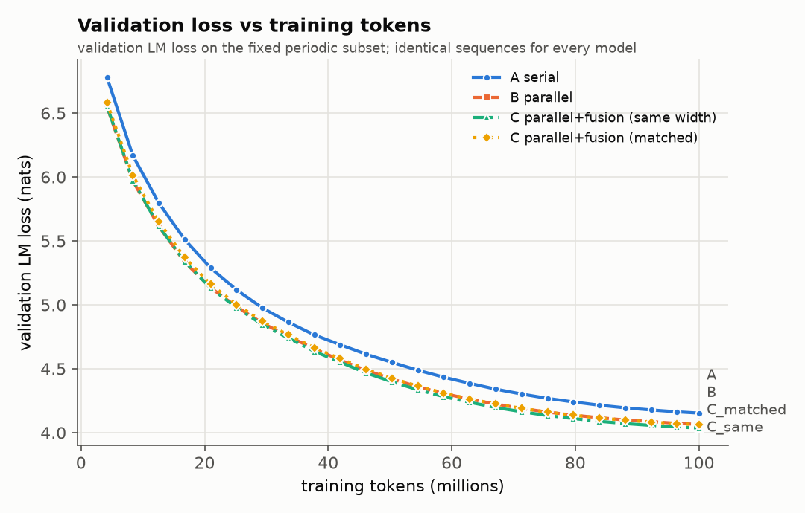
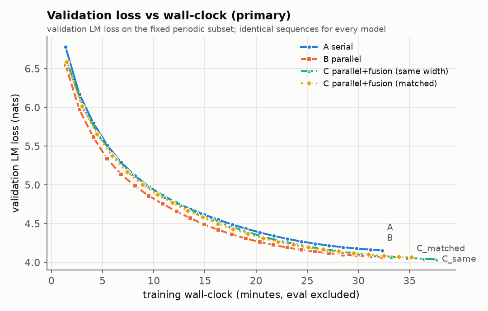
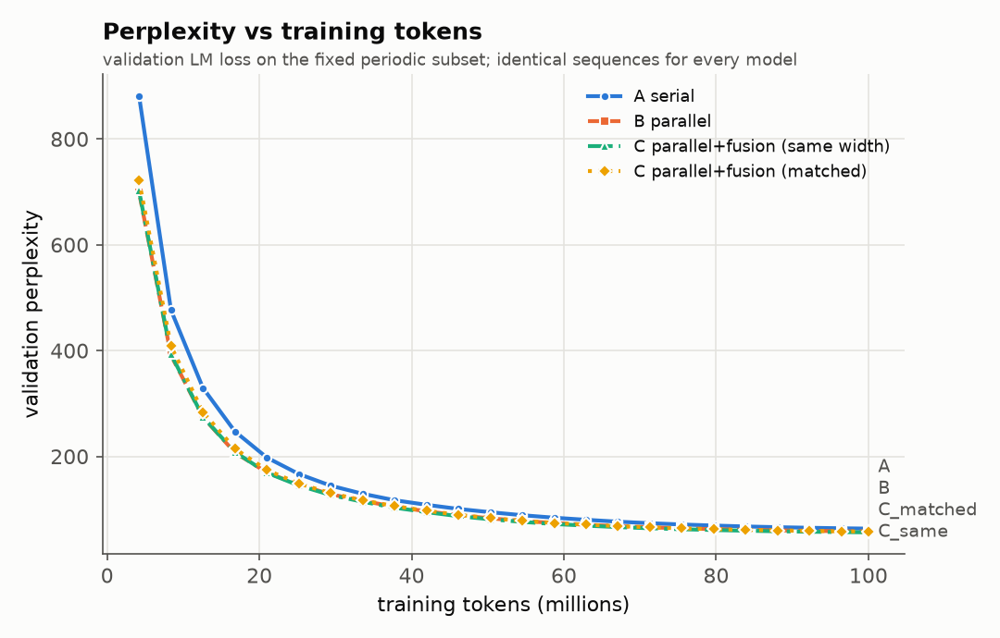
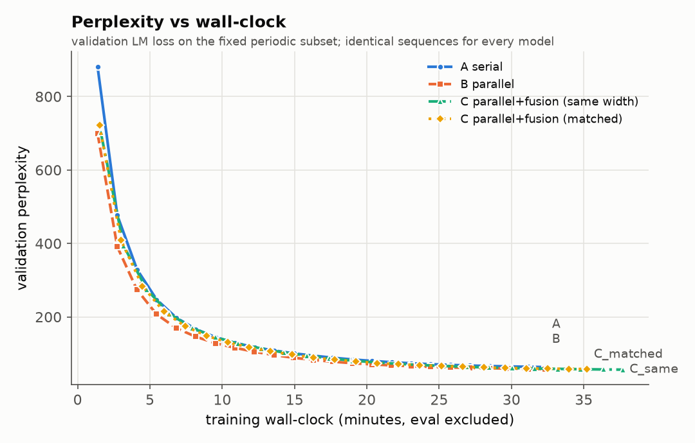
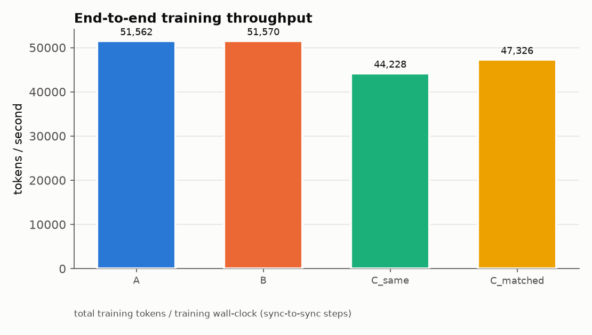
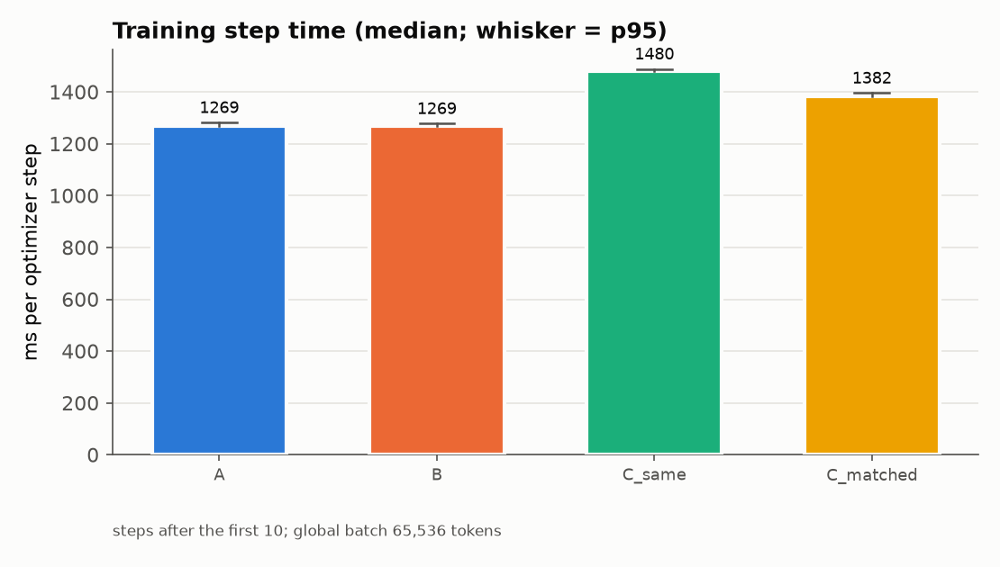
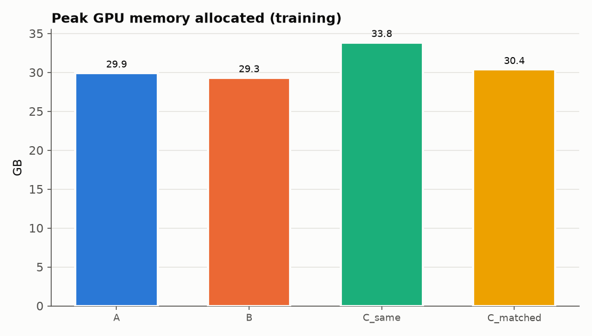
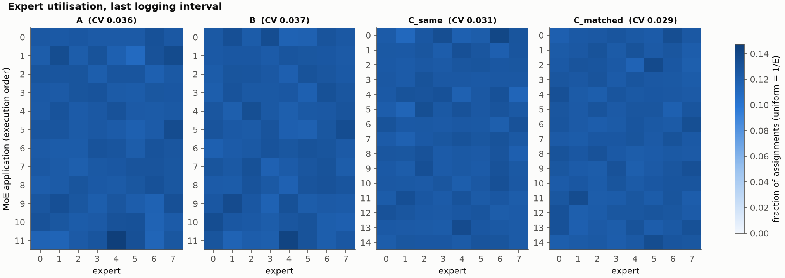
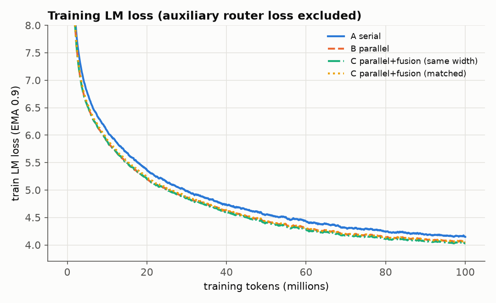

# FINAL REPORT - Serial vs Parallel vs Parallel+Fusion MoE (MAIN)

_Generated automatically 2026-10-06T20:14:25+0000 from experiment logs in `/content/moe_fusion_runs/main`. No number in this file is hand-written._

> **STATUS: MAIN, seed(s) [42].** 100M training tokens per model. With a single seed, differences below the pre-registered 0.053-nat single-seed threshold (EXPERIMENT_SPEC Amendment 4, measured seed spread) are not decisive, and no result is replicated.

## VERDICT (pre-registered rule, EXPERIMENT_SPEC Amendment 2)

**Fusion (your parallel + periodic FusionMoE method): INCONCLUSIVE: the fusion effect lies between the equivalence margin and the decision threshold; replicate B and the C variants with seed 43 before concluding. (single seed: not replicated)**

Rule: d_s = paired dL per seed; better/worse require the same sign with a CI excluding 0 in EVERY seed AND abs(mean d) >= threshold = max(0.02, observed seed spread) [single seed: max(0.02, 0.053 measured in the diagnostic phase)]; equal requires abs(d) < 0.02 nats in every seed; anything else is inconclusive.

| comparison | dL per seed (nats) | mean dL | threshold | verdict |
|---|---|---|---|---|
| C_same - B (does adding fusion help?) | -0.0293 | -0.0293 | 0.053 | inconclusive (consistent direction but abs(dL) below the 0.053-nat threshold) |
| C_matched - B (fusion at the SAME budget) | -0.0021 | -0.0021 | 0.053 | approximately equal (within pre-registered margin in every seed) |
| C_matched - C_same | +0.0272 | +0.0272 | 0.053 | inconclusive (consistent direction but abs(dL) below the 0.053-nat threshold) |
| B - A (parallel vs serial) | -0.0891 | -0.0891 | 0.053 | better (CI excludes 0 and abs(dL) >= 0.053 nats) |
| C_same - A | -0.1185 | -0.1185 | 0.053 | better (CI excludes 0 and abs(dL) >= 0.053 nats) |
| C_matched - A | -0.0913 | -0.0913 | 0.053 | better (CI excludes 0 and abs(dL) >= 0.053 nats) |

* C_same_minus_B_at_common_wallclock: seed 42: +0.0164 -> worse per wall-clock in every seed

* C_matched_minus_B_at_common_wallclock: seed 42: +0.0201 -> worse per wall-clock in every seed

| model | final val loss per seed | mean | train minutes (mean) |
|---|---|---|---|
| A | 4.1564 | 4.1564 | 32.3 |
| B | 4.0672 | 4.0672 | 32.3 |
| C_same | 4.0379 | 4.0379 | 37.7 |
| C_matched | 4.0651 | 4.0651 | 35.2 |

## A. Experiment question

Can the strict Attention -> MoE dependency be removed from most Transformer layers (Attention and MoE as parallel branches) and the lost interaction recovered by periodic Fusion MoE layers, giving a better quality-versus-wall-clock trade-off?

## B. Architecture definitions

* **A (serial):** `a = x + Attn(RMSNorm(x)); y = a + MoE(RMSNorm(a))`
* **B (parallel):** `y = x + Attn(RMSNorm_a(x)) + MoE(RMSNorm_m(x))` - identical parameter set to A (bit-identical init).
* **C (parallel + fusion):** B blocks, plus `x = x + FusionMoE(RMSNorm_f(x))` after blocks 4, 8 and 12 (12 attention + 15 MoE applications). `C_same`: expert hidden 1920 (extra compute, mechanism test). `C_matched`: expert hidden 1536 so that 15 x 1536 = 12 x 1920 (compute/parameter matched).
* Shared: 12 layers, d_model 768, 12 heads x 64, RoPE, RMSNorm, 8 SwiGLU experts top-2 (no token dropping), tied embeddings, vocab 32,000, context 1024, BF16 autocast.

## C. Dataset

* Source: FineWeb-Edu sample-10BT (pinned revision, first 300k documents, document-level split).
* train.npy [287264, 1025] / validation.npy [15088, 1025] (seq_len+1 (input=row[:-1], target=row[1:])).
* Leakage check: {'train_docs': 285000, 'val_docs': 15000, 'source_ids_available': True, 'source_id_overlap': 0, 'exact_text_overlap_docs': 13, 'exact_text_overlap_fraction_of_val': 0.0008666666666666666, 'duplicate_texts_within_val': 0, 'passed': True}
* Re-tokenisation provenance check: validation: VERIFIED (append), train: VERIFIED (append)

* Data was rebuilt from the pinned source by `prepare_fineweb.py`: byte-identical to the original preparation = **True**; inferred conventions {'validation_rule': 'doc_index % 20 == 0', 'eot_per_doc': 1, 'eot_placement': 'append', 'dtype': 'uint16', 'row_len': 1025, 'jsonl_format': 'id_text_utf8'}.

* Dataset warnings: 13 validation documents have an exact-text duplicate in train under different source ids (web near-duplicates; reported, not removed)

## D. Tokenizer

One ByteLevel-BPE artifact for every model: vocab 32000, special tokens {'<|unk|>': 0, '<|endoftext|>': 1}, sha256 `2a6d7dcaa8f5cfec135c835ff0cf5ffb14c1f9508c0cfb8113bfebc3883c2187`.

## E. Training setup (identical for every architecture)

* Steps 1526, tokens 100,007,936, global batch 64 x 1024 tokens, micro-batch 16 x grad-accum 4 (common to all, from the memory probe), AdamW(0.9, 0.95, wd 0.1), peak LR 0.0003, 2% linear warm-up, cosine to 0.1 x peak, clip 1.0, balance-loss coefficient 0.01 per router (sum over MoE applications), z-loss coefficient 0.0 (always logged), BF16 autocast with FP32 master weights / router / norms / loss.
* Same data order (BatchSchedule seeded by the paired seed), same evaluation points, same validation rows; evaluation and checkpoint time excluded from the wall-clock axis.

* **Automated fairness audit: PASSED**

| check | result | detail |
|---|---|---|
| train config identical (B_parallel vs A_serial) | PASS |  |
| model config differs only in architecture fields (B_parallel) | PASS |  |
| train config identical (C_parallel_fusion_samewidth vs A_serial) | PASS |  |
| model config differs only in architecture fields (C_parallel_fusion_samewidth) | PASS |  |
| train config identical (C_parallel_fusion_matched vs A_serial) | PASS |  |
| model config differs only in architecture fields (C_parallel_fusion_matched) | PASS |  |
| identical optimizer steps | PASS | {'A_serial': 1526, 'B_parallel': 1526, 'C_parallel_fusion_samewidth': 1526, 'C_parallel_fusion_matched': 1526} |
| identical training tokens | PASS |  |
| identical micro-batch / grad-accum | PASS |  |
| identical evaluation steps | PASS |  |
| identical final validation set | PASS |  |
| all runs (incl. resumed segments) on the same GPU model | PASS | {'NVIDIA A100-SXM4-40GB'} |
| identical attention_backend | PASS |  |
| identical moe_backend | PASS |  |
| identical parallel_backend | PASS |  |
| identical code fingerprint | PASS | {'51690dc701b48ee7ba2bd75357f0dd79d8f5682dd6ef394fc832e400b6c2899c'} |
| identical dataset hashes | PASS |  |

## F. Hardware / software environment

GPU NVIDIA A100-SXM4-40GB (42.41 GB, cc 8.0), driver/nvidia-smi `580.82.07, NVIDIA A100-SXM4-40GB, 40960 MiB, 1410 MHz`, PyTorch 2.11.0+cu130, CUDA 13.0, Python 3.13.15. Attention backend: **sdpa_flash** (fallback used: False). MoE backend: reference. Primary comparison parallel execution: reference (sequential dispatch) for every architecture.

## G/H. Parameter and FLOP budget

| model | MoE apps | expert hidden | total params | expert params | active params/token | train FLOPs/token |
|---|---|---|---|---|---|---|
| B_parallel | 12 | 1920 | 477.654M | 424.673M | 159.149M | 1.068B |
| C_parallel_fusion_samewidth | 15 | 1920 | 583.843M | 530.842M | 185.712M | 1.227B |
| C_parallel_fusion_matched | 15 | 1536 | 477.674M | 424.673M | 159.170M | 1.068B |
| A_serial | 12 | 1920 | 477.654M | 424.673M | 159.149M | 1.068B |

Compute matching `C_parallel_fusion_matched` vs A: expert params +0.000%, active MoE FLOPs +0.000%, total params +0.004%, train FLOPs/token +0.010% (FLOP convention: see flop_counter.py).

## I. Validation results (MEASURED)

| model | final val LM loss (full val set) | perplexity | val tokens |
|---|---|---|---|
| A | 4.1564 | 63.84 | 15,450,112 |
| B | 4.0672 | 58.40 | 15,450,112 |
| C_same | 4.0379 | 56.71 | 15,450,112 |
| C_matched | 4.0651 | 58.27 | 15,450,112 |

Paired differences (row model minus column model, same validation sequences; 95% CI):

| comparison | dL (nats) [95% CI] | bootstrap CI | seqs where first is better | classification |
|---|---|---|---|---|
| Q1: B vs A (cost of removing same-layer Attention->MoE dependency) | -0.0891 [-0.0899, -0.0883] | [-0.0899, -0.0884] | 99.6% | better (CI excludes 0) |
| Q2: C_same vs B (effect of periodic fusion, extra compute) | -0.0293 [-0.0297, -0.0290] | [-0.0297, -0.0290] | 92.2% | better (CI excludes 0) |
| C_same vs A (NOT a compute-fair comparison) | -0.1185 [-0.1193, -0.1176] | [-0.1193, -0.1176] | 100.0% | better (CI excludes 0) |
| Q3: C_matched vs A (compute/parameter matched) | -0.0913 [-0.0920, -0.0905] | [-0.0920, -0.0905] | 99.8% | better (CI excludes 0) |
| C_matched vs B | -0.0021 [-0.0025, -0.0018] | [-0.0025, -0.0018] | 54.3% | approximately equal (within pre-registered margin) |
| C_matched vs C_same (width vs. fusion budget) | +0.0272 [+0.0268, +0.0276] | [+0.0268, +0.0276] | 10.6% | worse (CI excludes 0) |

## J/K. Throughput and wall-clock (MEASURED)

| model | training wall-clock (min) | tokens/s | median step (ms) | p95 step (ms) | median data wait (ms) |
|---|---|---|---|---|---|
| A | 32.33 | 51,562 | 1269.3 | 1282.2 | 2.04 |
| B | 32.32 | 51,570 | 1269.3 | 1278.2 | 1.98 |
| C_same | 37.69 | 44,228 | 1480.3 | 1488.8 | 2.13 |
| C_matched | 35.22 | 47,326 | 1382.3 | 1396.1 | 2.11 |

**Time-to-target** (targets = worst final periodic-subset loss (4.1541) + [0.0, 0.05, 0.1, 0.25]; periodic-subset curve, linear interpolation):

| target loss | A (min / M tokens) | B (min / M tokens) | C_same (min / M tokens) | C_matched (min / M tokens) |
|---|---|---|---|---|
| 4.1541 | 32.33 / 100.0 | 24.86 / 76.9 | 27.45 / 72.8 | 27.08 / 76.8 |
| 4.2041 | 27.90 / 86.3 | 22.54 / 69.7 | 25.07 / 66.5 | 24.58 / 69.7 |
| 4.2541 | 25.15 / 77.8 | 20.66 / 63.9 | 23.17 / 61.4 | 22.59 / 64.0 |
| 4.4041 | 19.87 / 61.4 | 16.66 / 51.5 | 18.87 / 50.0 | 18.31 / 51.9 |

**Loss at common wall-clock** T* = 32.32 min (validation loss (periodic subset) linearly interpolated at the training wall-clock at which the FASTEST model finished its token budget): A 4.1541, B 4.0656, C_same 4.0821, C_matched 4.0857

**Systems benchmark / profiling:** not repeated in MAIN (token-independent); see the PILOT report (`runs/pilot/FINAL_REPORT.md`): no meaningful attention/MoE kernel overlap, concurrent speed-up <= 1%.

## L. VRAM (MEASURED)

A: 29.9 GB allocated / 33.2 GB reserved, B: 29.3 GB allocated / 32.7 GB reserved, C_same: 33.8 GB allocated / 36.0 GB reserved, C_matched: 30.4 GB allocated / 33.7 GB reserved

## M. Router / expert behaviour (MEASURED)

| model | utilisation CV (mean over layers) | worst max/min ratio | min expert fraction | router entropy (max ln8=2.079) | alerts |
|---|---|---|---|---|---|
| A | 0.036 | 1.29 | 0.1096 | 1.460 | dead-expert intervals from steps [16], dead_expert_alert, dead_expert_cleared |
| B | 0.037 | 1.23 | 0.1159 | 1.499 | none |
| C_same | 0.031 | 1.26 | 0.1113 | 1.522 | dead-expert intervals from steps [16], dead_expert_alert, dead_expert_cleared |
| C_matched | 0.029 | 1.19 | 0.1152 | 1.493 | dead-expert intervals from steps [16], dead_expert_alert, dead_expert_cleared |

## N. CUDA concurrency / profiling evidence (MEASURED)

Traces: `profiles/*.json` (open in https://ui.perfetto.dev). Method and caveats: `src/moefusion/trace_analysis.py`.

## O. Failures or anomalies

* A: {'step': 16, 'event': 'dead_expert_alert', 'layers': [10], 'layer_names': ['block10'], 'min_fraction': 0.00792}
* A: {'step': 32, 'event': 'dead_expert_cleared', 'layers': [], 'layer_names': [], 'min_fraction': 0.05481}
* C_same: {'step': 16, 'event': 'dead_expert_alert', 'layers': [14], 'layer_names': ['fusion_after_block11'], 'min_fraction': 0.01015}
* C_same: {'step': 32, 'event': 'dead_expert_cleared', 'layers': [], 'layer_names': [], 'min_fraction': 0.07684}
* C_matched: {'step': 16, 'event': 'dead_expert_alert', 'layers': [14], 'layer_names': ['fusion_after_block11'], 'min_fraction': 0.0121}
* C_matched: {'step': 32, 'event': 'dead_expert_cleared', 'layers': [], 'layer_names': [], 'min_fraction': 0.07559}
* 13 validation documents have an exact-text duplicate in train under different source ids (web near-duplicates; reported, not removed)

## P. Statistical uncertainty

Single paired seed. Paired CIs over validation sequences quantify evaluation noise only, not seed-to-seed training variance. The decision rule therefore uses the observed seed spread (single seed: 0.053 nats measured in the diagnostic phase, Amendment 4) and the 0.02-nat equivalence margin; a 'CI excludes 0' classification alone is not a verdict.

## Q. Answers to the pre-registered questions

_MEASURED values are followed by the INTERPRETATION that the pre-registered rules allow._

**Q1 - quality lost from A to B:** MEASURED dL(B-A) = -0.0891 [-0.0899, -0.0883] nats. INTERPRETATION: better (CI excludes 0).

**Q2 - recovered by C:** MEASURED dL(C_same-B) = -0.0293 [-0.0297, -0.0290]; recovered fraction of the B-A gap: n/a (C_same), n/a (C_matched). INTERPRETATION: CI-only classification better (CI excludes 0); pre-registered verdict: inconclusive (consistent direction but abs(dL) below the 0.053-nat threshold). The recovered fraction is undefined because B is not significantly worse than A.

**Q3 - does C help when compute is matched:** MEASURED dL(C_matched-A) = -0.0913 [-0.0920, -0.0905], dL(C_matched-B) = -0.0021 [-0.0025, -0.0018]. INTERPRETATION vs A: better (CI excludes 0).

**Q4 - A100 wall-clock speed-up of the parallel structure:** MEASURED training step time B vs A: +0.00% (both use the same sequential dispatch). Benchmark concurrency ratio: not available. INTERPRETATION: differences below 2% are treated as no speed difference. A mathematically parallel block yields hardware speed-up only through kernel concurrency or fused projections (see Q5/Q6); with sequential dispatch it performs the same work as A.

**Q5/Q6:** benchmark not available.

**Q7 - time-to-target:** see the table in section J/K.

**Q8 - best validation loss per token (equal tokens for all):** MEASURED lowest final loss: **C_same** (4.0379). Whether it is distinguishable from the others: see the paired table.

**Q9 - best validation loss per wall-clock second:** MEASURED lowest loss at common wall-clock T*: **B** (4.0656). Note that C_same also spends more compute per token.

**Q10 - is fusion_interval=4 promising enough for 2/8/final-only ablations?** Pre-registered rule: yes if dL(C_same-B) has a 95% CI entirely below 0. MEASURED: -0.0293 [-0.0297, -0.0290] -> **YES (provisional)** Under the decision threshold the effect is: inconclusive (consistent direction but abs(dL) below the 0.053-nat threshold); see the Amendment 5 plan before running ablations.

## R. Limitations

* Small scale (12 layers, d 768, ~160M active / ~480-590M total params, 25M-100M tokens): evidence is small-scale architectural evidence, not a claim about billion/trillion-parameter LLMs.
* One seed in the pilot; CI excludes training-seed variance.
* Hyperparameters were NOT tuned per architecture (by design); a recipe tuned for A could favour A.
* Wall-clock depends on this implementation (reference MoE with one host sync per MoE layer, SDPA attention) and on Colab conditions; runs are sequential in one session, the systems benchmark interleaves models to control drift.
* Time-to-target and loss at common wall-clock read intermediate points of a cosine schedule sized for the full token budget; such intermediate points are pessimistic relative to a run whose schedule ends there (Hoffmann et al. 2022), which biases these two metrics against the slower model.
* The periodic validation curve uses a fixed 2,048-sequence subset; final numbers use the full validation set.

## S. Recommended next experiment

* Follow the pre-registered plan in EXPERIMENT_SPEC Amendment 5: (1) iso-FLOP baseline (B trained on the extra compute that C_same spends), (2) fusion-layer knock-out on the trained C_same weights, (3) single-fusion-layer variant against its own iso-FLOP B, (4) seed replication of whatever remains undecided.

* Systems track (separate label): fused Attention/MoE input projections and concurrent execution in training.

## Plots

---
**SPECULATION** is intentionally absent from the measured sections above; any hypothesis about *why* a pattern occurs must be tested in a follow-up experiment.
