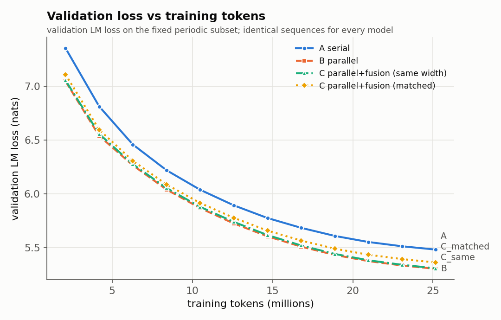
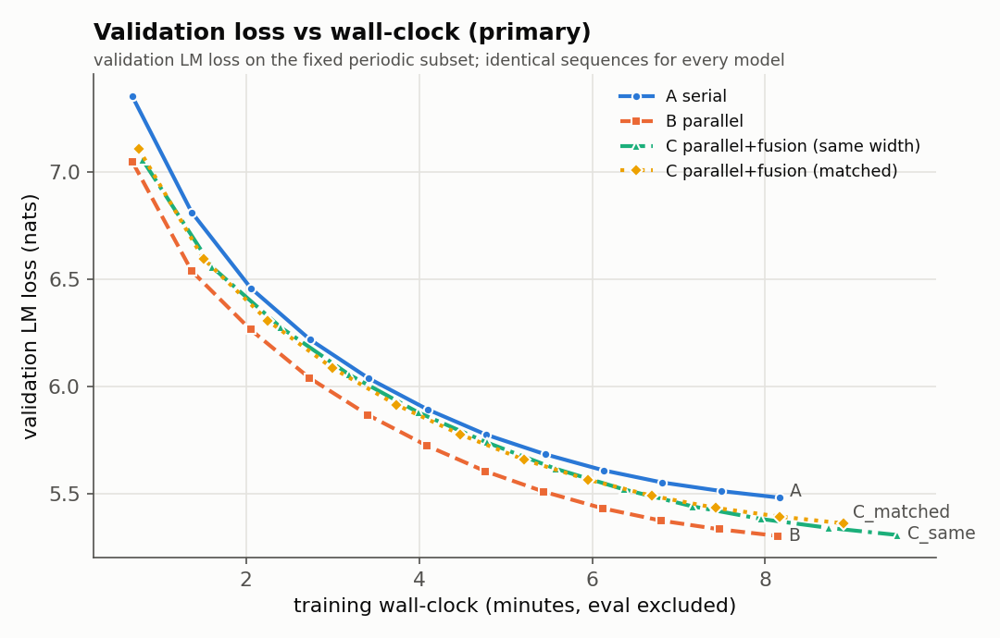
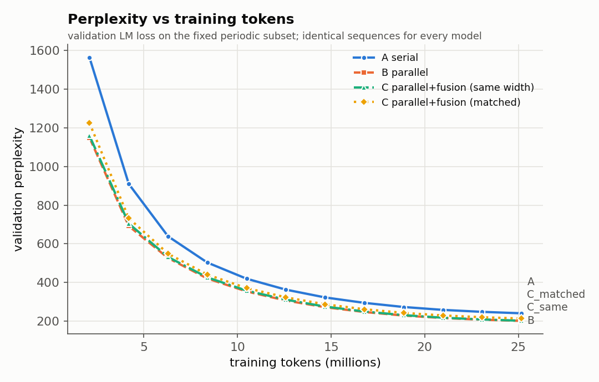
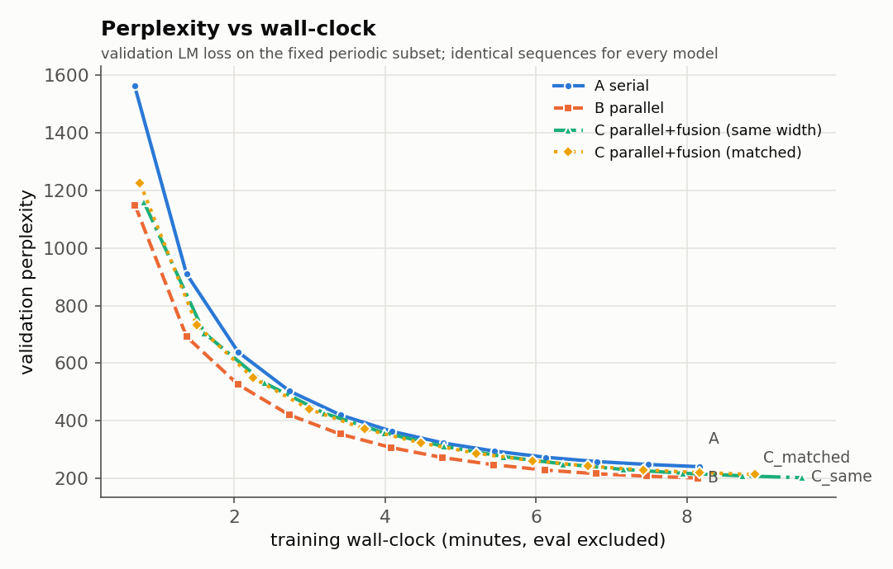
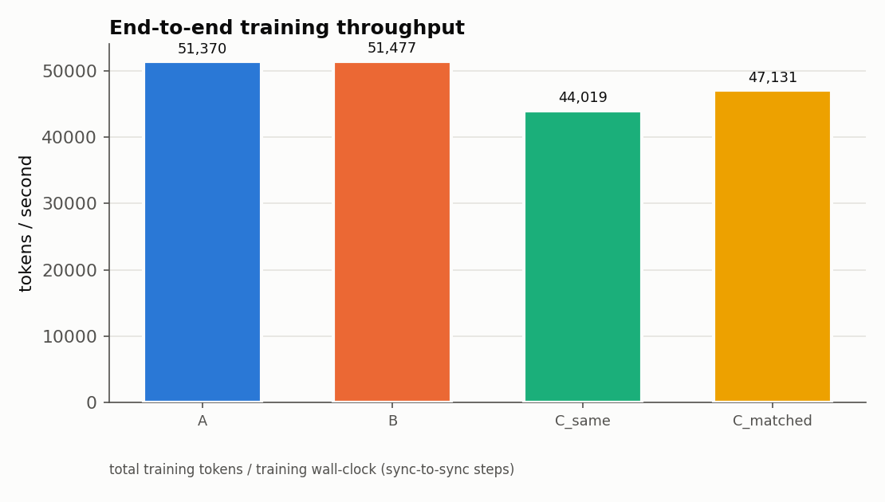
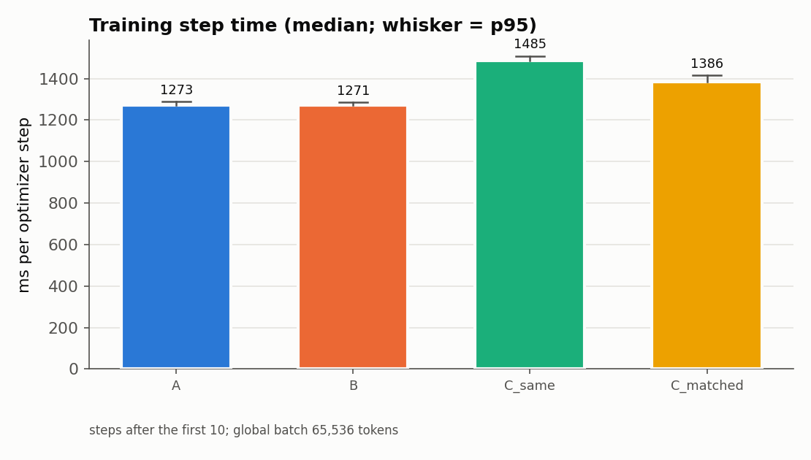
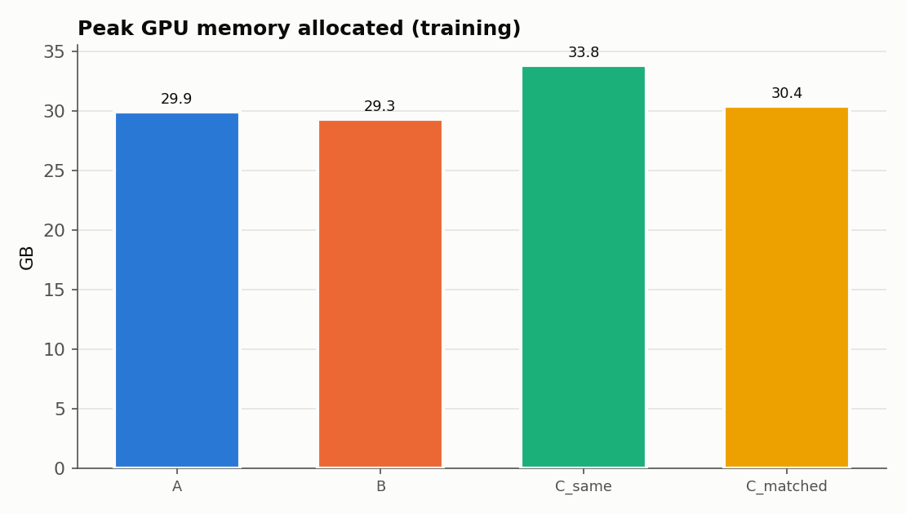
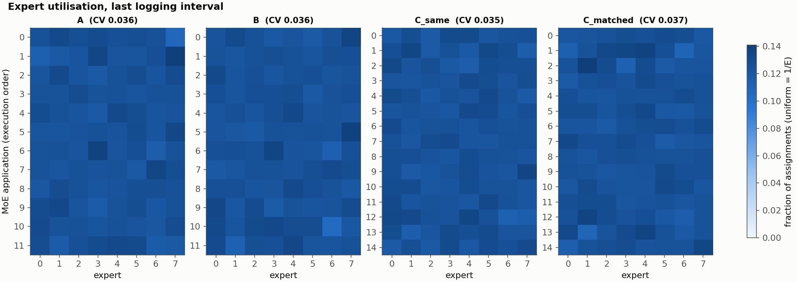
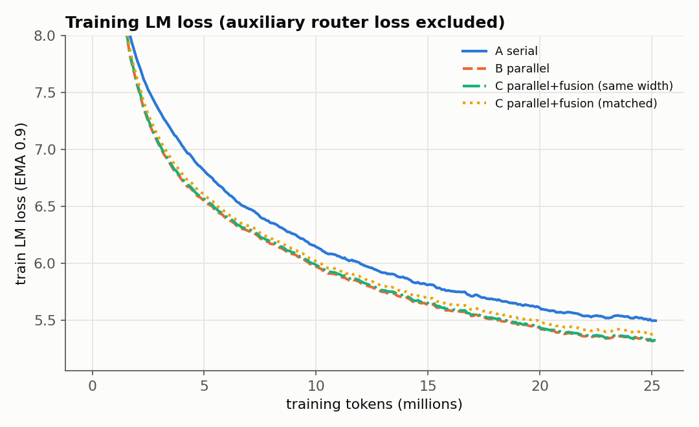
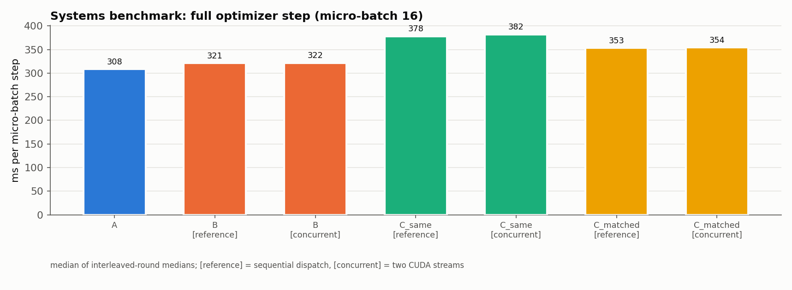

# FINAL REPORT - Serial vs Parallel vs Parallel+Fusion MoE (PILOT)

_Generated automatically 2026-10-04T18:23:04+0000 from experiment logs in `/content/moe_fusion_runs/pilot`. No number in this file is hand-written._

> **STATUS: PILOT.** One paired seed, ~25M tokens per model. The pre-registered purpose of the pilot is to detect catastrophic bugs and obtain a first, NON-CONFIRMATORY comparison. Confidence intervals below capture validation-data noise only, not seed-to-seed training variance. No claim in this report is confirmatory.

## A. Experiment question

Can the strict Attention -> MoE dependency be removed from most Transformer layers (Attention and MoE as parallel branches) and the lost interaction recovered by periodic Fusion MoE layers, giving a better quality-versus-wall-clock trade-off?

## B. Architecture definitions

* **A (serial):** `a = x + Attn(RMSNorm(x)); y = a + MoE(RMSNorm(a))`
* **B (parallel):** `y = x + Attn(RMSNorm_a(x)) + MoE(RMSNorm_m(x))` - identical parameter set to A (bit-identical init).
* **C (parallel + fusion):** B blocks, plus `x = x + FusionMoE(RMSNorm_f(x))` after blocks 4, 8 and 12 (12 attention + 15 MoE applications). `C_same`: expert hidden 1920 (extra compute, mechanism test). `C_matched`: expert hidden 1536 so that 15 x 1536 = 12 x 1920 (compute/parameter matched).
* Shared: 12 layers, d_model 768, 12 heads x 64, RoPE, RMSNorm, 8 SwiGLU experts top-2 (no token dropping), tied embeddings, vocab 32,000, context 1024, BF16 autocast.

## C. Dataset

* Source: FineWeb-Edu sample-10BT (pinned revision, first 300k documents, document-level split).
* train.npy [287264, 1025] / validation.npy [15088, 1025] (seq_len+1 (input=row[:-1], target=row[1:])).
* Leakage check: {'train_docs': 285000, 'val_docs': 15000, 'source_ids_available': True, 'source_id_overlap': 0, 'exact_text_overlap_docs': 13, 'exact_text_overlap_fraction_of_val': 0.0008666666666666666, 'duplicate_texts_within_val': 0, 'passed': True}
* Re-tokenisation provenance check: validation: VERIFIED (append), train: VERIFIED (append)

* Data was rebuilt from the pinned source by `prepare_fineweb.py`: byte-identical to the original preparation = **True**; inferred conventions {'validation_rule': 'doc_index % 20 == 0', 'eot_per_doc': 1, 'eot_placement': 'append', 'dtype': 'uint16', 'row_len': 1025, 'jsonl_format': 'id_text_utf8'}.

* Dataset warnings: 13 validation documents have an exact-text duplicate in train under different source ids (web near-duplicates; reported, not removed)

## D. Tokenizer

One ByteLevel-BPE artifact for every model: vocab 32000, special tokens {'<|unk|>': 0, '<|endoftext|>': 1}, sha256 `2a6d7dcaa8f5cfec135c835ff0cf5ffb14c1f9508c0cfb8113bfebc3883c2187`.

## E. Training setup (identical for every architecture)

* Steps 384, tokens 25,165,824, global batch 64 x 1024 tokens, micro-batch 16 x grad-accum 4 (common to all, from the memory probe), AdamW(0.9, 0.95, wd 0.1), peak LR 0.0003, 2% linear warm-up, cosine to 0.1 x peak, clip 1.0, balance-loss coefficient 0.01 per router (sum over MoE applications), z-loss coefficient 0.0 (always logged), BF16 autocast with FP32 master weights / router / norms / loss.
* Same data order (BatchSchedule seeded by the paired seed), same evaluation points, same validation rows; evaluation and checkpoint time excluded from the wall-clock axis.

* **Automated fairness audit: PASSED**

| check | result | detail |
|---|---|---|
| train config identical (B_parallel vs A_serial) | PASS |  |
| model config differs only in architecture fields (B_parallel) | PASS |  |
| train config identical (C_parallel_fusion_samewidth vs A_serial) | PASS |  |
| model config differs only in architecture fields (C_parallel_fusion_samewidth) | PASS |  |
| train config identical (C_parallel_fusion_matched vs A_serial) | PASS |  |
| model config differs only in architecture fields (C_parallel_fusion_matched) | PASS |  |
| identical optimizer steps | PASS | {'A_serial': 384, 'B_parallel': 384, 'C_parallel_fusion_samewidth': 384, 'C_parallel_fusion_matched': 384} |
| identical training tokens | PASS |  |
| identical micro-batch / grad-accum | PASS |  |
| identical evaluation steps | PASS |  |
| identical final validation set | PASS |  |
| all runs (incl. resumed segments) on the same GPU model | PASS | {'NVIDIA A100-SXM4-40GB'} |
| identical attention_backend | PASS |  |
| identical moe_backend | PASS |  |
| identical parallel_backend | PASS |  |
| identical code fingerprint | PASS | {'132bb8f6bf80e3d354c47240aac4632796a50d422d329cb906c3d2e56973bb98'} |
| identical dataset hashes | PASS |  |

## F. Hardware / software environment

GPU NVIDIA A100-SXM4-40GB (42.41 GB, cc 8.0), driver/nvidia-smi `580.82.07, NVIDIA A100-SXM4-40GB, 40960 MiB, 1410 MHz`, PyTorch 2.11.0+cu130, CUDA 13.0, Python 3.13.15. Attention backend: **sdpa_flash** (fallback used: False). MoE backend: reference. Primary comparison parallel execution: reference (sequential dispatch) for every architecture.

## G/H. Parameter and FLOP budget

| model | MoE apps | expert hidden | total params | expert params | active params/token | train FLOPs/token |
|---|---|---|---|---|---|---|
| A_serial | 12 | 1920 | 477.654M | 424.673M | 159.149M | 1.068B |
| B_parallel | 12 | 1920 | 477.654M | 424.673M | 159.149M | 1.068B |
| C_parallel_fusion_samewidth | 15 | 1920 | 583.843M | 530.842M | 185.712M | 1.227B |
| C_parallel_fusion_matched | 15 | 1536 | 477.674M | 424.673M | 159.170M | 1.068B |

Compute matching `C_parallel_fusion_matched` vs A: expert params +0.000%, active MoE FLOPs +0.000%, total params +0.004%, train FLOPs/token +0.010% (FLOP convention: see flop_counter.py).

## I. Validation results (MEASURED)

| model | final val LM loss (full val set) | perplexity | val tokens |
|---|---|---|---|
| A | 5.4918 | 242.70 | 15,450,112 |
| B | 5.3129 | 202.94 | 15,450,112 |
| C_same | 5.3175 | 203.88 | 15,450,112 |
| C_matched | 5.3715 | 215.18 | 15,450,112 |

Paired differences (row model minus column model, same validation sequences; 95% CI):

| comparison | dL (nats) [95% CI] | bootstrap CI | seqs where first is better | classification |
|---|---|---|---|---|
| Q1: B vs A (cost of removing same-layer Attention->MoE dependency) | -0.1789 [-0.1795, -0.1783] | [-0.1796, -0.1783] | 100.0% | better (CI excludes 0) |
| Q2: C_same vs B (effect of periodic fusion, extra compute) | +0.0046 [+0.0043, +0.0049] | [+0.0043, +0.0049] | 38.9% | approximately equal (within pre-registered margin) |
| C_same vs A (NOT a compute-fair comparison) | -0.1743 [-0.1749, -0.1737] | [-0.1749, -0.1738] | 100.0% | better (CI excludes 0) |
| Q3: C_matched vs A (compute/parameter matched) | -0.1204 [-0.1208, -0.1199] | [-0.1208, -0.1199] | 100.0% | better (CI excludes 0) |
| C_matched vs B | +0.0586 [+0.0582, +0.0589] | [+0.0582, +0.0589] | 0.5% | worse (CI excludes 0) |
| C_matched vs C_same (width vs. fusion budget) | +0.0540 [+0.0536, +0.0543] | [+0.0536, +0.0543] | 0.5% | worse (CI excludes 0) |

## J/K. Throughput and wall-clock (MEASURED)

| model | training wall-clock (min) | tokens/s | median step (ms) | p95 step (ms) | median data wait (ms) |
|---|---|---|---|---|---|
| A | 8.16 | 51,370 | 1273.3 | 1290.0 | 1.86 |
| B | 8.15 | 51,477 | 1270.6 | 1286.6 | 1.90 |
| C_same | 9.53 | 44,019 | 1485.3 | 1509.3 | 2.13 |
| C_matched | 8.90 | 47,131 | 1385.8 | 1417.1 | 2.09 |

**Time-to-target** (targets = worst final periodic-subset loss (5.4839) + [0.0, 0.05, 0.1, 0.25]; periodic-subset curve, linear interpolation):

| target loss | A (min / M tokens) | B (min / M tokens) | C_same (min / M tokens) | C_matched (min / M tokens) |
|---|---|---|---|---|
| 5.4839 | 8.16 / 25.2 | 5.68 / 17.5 | 6.75 / 17.8 | 6.80 / 19.2 |
| 5.5339 | 7.16 / 22.1 | 5.28 / 16.3 | 6.27 / 16.5 | 6.28 / 17.7 |
| 5.5839 | 6.46 / 19.9 | 4.93 / 15.2 | 5.86 / 15.4 | 5.82 / 16.4 |
| 5.7339 | 5.10 / 15.7 | 4.05 / 12.5 | 4.83 / 12.7 | 4.75 / 13.4 |

**Loss at common wall-clock** T* = 8.15 min (validation loss (periodic subset) linearly interpolated at the training wall-clock at which the FASTEST model finished its token budget): A 5.4847, B 5.3051, C_same 5.3739, C_matched 5.3965

**Systems benchmark** (separate from training; one micro-batch of 16 sequences, untrained weights, 3 interleaved rotated rounds):

| variant | forward ms | fwd+bwd ms | optimizer step ms | tokens/s (step) | peak GB |
|---|---|---|---|---|---|
| A_serial | 79.2 | 311.8 | 308.4 | 53,132 | 27.9 |
| B_parallel[reference] | 79.1 | 312.6 | 321.0 | 51,040 | 27.4 |
| B_parallel[concurrent] | 76.9 | 313.1 | 321.7 | 50,923 | 27.4 |
| C_samewidth[reference] | 91.8 | 364.1 | 378.3 | 43,310 | 31.5 |
| C_samewidth[concurrent] | 90.2 | 368.6 | 382.1 | 42,877 | 31.5 |
| C_matched[reference] | 85.9 | 339.8 | 353.3 | 46,368 | 28.4 |
| C_matched[concurrent] | 83.7 | 344.2 | 354.5 | 46,222 | 28.4 |

## L. VRAM (MEASURED)

A: 29.9 GB allocated / 35.3 GB reserved, B: 29.3 GB allocated / 32.7 GB reserved, C_same: 33.8 GB allocated / 38.1 GB reserved, C_matched: 30.4 GB allocated / 35.8 GB reserved

## M. Router / expert behaviour (MEASURED)

| model | utilisation CV (mean over layers) | worst max/min ratio | min expert fraction | router entropy (max ln8=2.079) | alerts |
|---|---|---|---|---|---|
| A | 0.036 | 1.24 | 0.1070 | 1.602 | expert_imbalance_alert, expert_imbalance_cleared |
| B | 0.036 | 1.27 | 0.1045 | 1.565 | expert_imbalance_alert, expert_imbalance_cleared |
| C_same | 0.035 | 1.19 | 0.1124 | 1.625 | expert_imbalance_alert, expert_imbalance_cleared |
| C_matched | 0.037 | 1.25 | 0.1094 | 1.632 | expert_imbalance_alert, expert_imbalance_cleared |

## N. CUDA concurrency / profiling evidence (MEASURED)

* `B_parallel(hidden=1920)` forward: attention 2.13 ms, MoE 4.07 ms, sum 6.20 ms, reference 6.38 ms, concurrent 6.20 ms -> speed-up 1.028x, saved -0.00 ms = -0.1% of the shorter branch. **No meaningful GPU overlap was achieved.**
* `B_parallel(hidden=1920)` forward_backward: attention 6.21 ms, MoE 16.70 ms, sum 22.91 ms, reference 23.27 ms, concurrent 23.10 ms -> speed-up 1.008x, saved -0.19 ms = -3.0% of the shorter branch. **No meaningful GPU overlap was achieved.**
* `C_parallel_fusion_matched(hidden=1536)` forward: attention 2.09 ms, MoE 3.60 ms, sum 5.69 ms, reference 5.85 ms, concurrent 5.78 ms -> speed-up 1.012x, saved -0.09 ms = -4.1% of the shorter branch. **No meaningful GPU overlap was achieved.**
* `C_parallel_fusion_matched(hidden=1536)` forward_backward: attention 6.23 ms, MoE 15.28 ms, sum 21.51 ms, reference 21.70 ms, concurrent 21.46 ms -> speed-up 1.011x, saved 0.05 ms = 0.8% of the shorter branch. **No meaningful GPU overlap was achieved.**
* Full-size reference vs concurrent equivalence: forward max |diff| 0.0, worst gradient relative L2 diff 2.208133810199797e-05 -> PASS.
* trace `A_serial`: 11548 kernels; forward attention/MoE kernel overlap 0 us (0.0% of the shorter branch); whole-step stream overlap: n/a (attention and MoE kernels share a CUDA stream (reference execution) or attribution failed)
* trace `B_parallel_reference`: 11548 kernels; forward attention/MoE kernel overlap 0 us (0.0% of the shorter branch); whole-step stream overlap: n/a (attention and MoE kernels share a CUDA stream (reference execution) or attribution failed)
* trace `B_parallel_concurrent`: 11548 kernels; forward attention/MoE kernel overlap 3740 us (7.6% of the shorter branch); whole-step stream overlap: 40999 us (26.3%)
* trace `C_parallel_fusion`: 13940 kernels; forward attention/MoE kernel overlap 0 us (0.0% of the shorter branch); whole-step stream overlap: n/a (attention and MoE kernels share a CUDA stream (reference execution) or attribution failed)
* trace `C_parallel_fusion_concurrent`: 13940 kernels; forward attention/MoE kernel overlap 3030 us (6.1% of the shorter branch); whole-step stream overlap: 38372 us (24.5%)

Traces: `profiles/*.json` (open in https://ui.perfetto.dev). Method and caveats: `src/moefusion/trace_analysis.py`.

## O. Failures or anomalies

* A: {'step': 16, 'event': 'expert_imbalance_alert', 'maxmin_ratio': 81.79000403063282}
* A: {'step': 48, 'event': 'expert_imbalance_cleared', 'maxmin_ratio': 5.826294202416584}
* B: {'step': 16, 'event': 'expert_imbalance_alert', 'maxmin_ratio': 13.735546411883673}
* B: {'step': 24, 'event': 'expert_imbalance_cleared', 'maxmin_ratio': 4.720076684990992}
* C_same: {'step': 24, 'event': 'expert_imbalance_alert', 'maxmin_ratio': 13.941750392008828}
* C_same: {'step': 32, 'event': 'expert_imbalance_cleared', 'maxmin_ratio': 3.9564388562157777}
* C_matched: {'step': 16, 'event': 'expert_imbalance_alert', 'maxmin_ratio': 30.051324200913243}
* C_matched: {'step': 40, 'event': 'expert_imbalance_cleared', 'maxmin_ratio': 5.894996932724422}
* 13 validation documents have an exact-text duplicate in train under different source ids (web near-duplicates; reported, not removed)

## P. Statistical uncertainty

Single paired seed. Paired CIs over validation sequences quantify evaluation noise only. Seed-to-seed variance of small LMs is typically of the same order as the effects of interest, so differences below the pre-registered margin (0.02 nats) - and any difference before the 3-seed replication - must be treated as provisional.

## Q. Answers to the pre-registered questions

_MEASURED values are followed by the INTERPRETATION that the pre-registered rules allow._

**Q1 - quality lost from A to B:** MEASURED dL(B-A) = -0.1789 [-0.1795, -0.1783] nats. INTERPRETATION: better (CI excludes 0).

**Q2 - recovered by C:** MEASURED dL(C_same-B) = +0.0046 [+0.0043, +0.0049]; recovered fraction of the B-A gap: n/a (C_same), n/a (C_matched). INTERPRETATION: fusion effect approximately equal (within pre-registered margin). The recovered fraction is undefined because B is not significantly worse than A.

**Q3 - does C help when compute is matched:** MEASURED dL(C_matched-A) = -0.1204 [-0.1208, -0.1199], dL(C_matched-B) = +0.0586 [+0.0582, +0.0589]. INTERPRETATION vs A: better (CI excludes 0).

**Q4 - A100 wall-clock speed-up of the parallel structure:** MEASURED training step time B vs A: -0.21% (both use the same sequential dispatch). Benchmark: B[concurrent] / B[reference] optimizer-step time ratio 1.002. INTERPRETATION: differences below 2% are treated as no speed difference. A mathematically parallel block yields hardware speed-up only through kernel concurrency or fused projections (see Q5/Q6); with sequential dispatch it performs the same work as A.

**Q5 - do attention and MoE kernels overlap:** MEASURED (block B_parallel(hidden=1920), fwd+bwd): No meaningful GPU overlap was achieved. Trace-level overlap numbers are in section N.

**Q6 - fraction of theoretical parallelism realised:** MEASURED time saved / shorter-branch time = -3.0% (forward+backward, one block; 100% = perfect overlap, <=0% = none).

**Q7 - time-to-target:** see the table in section J/K.

**Q8 - best validation loss per token (equal tokens for all):** MEASURED lowest final loss: **B** (5.3129). Whether it is distinguishable from the others: see the paired table.

**Q9 - best validation loss per wall-clock second:** MEASURED lowest loss at common wall-clock T*: **B** (5.3051). Note that C_same also spends more compute per token.

**Q10 - is fusion_interval=4 promising enough for 2/8/final-only ablations?** Pre-registered rule: yes if dL(C_same-B) has a 95% CI entirely below 0. MEASURED: +0.0046 [+0.0043, +0.0049] -> **NOT by the pre-registered rule** - pilot only; confirm in MAIN before spending ablation compute.

## R. Limitations

* Small scale (12 layers, d 768, ~160M active / ~480-590M total params, 25M-100M tokens): evidence is small-scale architectural evidence, not a claim about billion/trillion-parameter LLMs.
* One seed in the pilot; CI excludes training-seed variance.
* Hyperparameters were NOT tuned per architecture (by design); a recipe tuned for A could favour A.
* Wall-clock depends on this implementation (reference MoE with one host sync per MoE layer, SDPA attention) and on Colab conditions; runs are sequential in one session, the systems benchmark interleaves models to control drift.
* The periodic validation curve uses a fixed 1,024-sequence subset; final numbers use the full validation set.

## S. Recommended next experiment

* If the fairness audit passed and no run failed: run MAIN (100M tokens) for the same four models, then the 3-seed replication (seeds 42/43/44) before any strong conclusion.
* Run the fusion-interval ablation (2 / 8 / final-only, compute-matched widths from `matched_hidden`) only if Q10 is positive in MAIN.
* Systems track (separate label): fused Attention/MoE input projections and concurrent execution in training.

## Plots

---
**SPECULATION** is intentionally absent from the measured sections above; any hypothesis about *why* a pattern occurs must be tested in a follow-up experiment.
